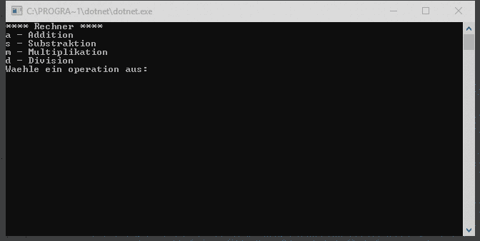

# Bedingte Anweisungen und Verzweigungen

Bedingte Anweisungen können ein Programm auf unterschiedliche Zustände und Eingaben reagieren lassen.

## ```if else```

Durch eine bedingte Anweisung wird entschieden ob ein bestimmtes Codesegment ausgeführt wird oder nicht. In _C#_ gibt es dafür Befehl ```if```.

```csharp
int zahl = 5;

if (zahl > 0) 
{
    Console.WriteLine("Zahl " + zahl + " ist eine positive Zahl.");
}
```

Eine Verzweigung besteht aus zwei Codezweigen, dem ```if``` Zweig und dem ptionalen ```else``` Zweig.

```csharp
int zahl = -1;

if (zahl > 0) 
{
    Console.WriteLine("Zahl " + zahl + " ist eine positive Zahl.");
}
else
{
    Console.WriteLine("Zahl " + zahl + " ist eine negative Zahl.");
}
 ```
### Aufgabe

Im letzten Beispiel gibt es noch ein Problem. Was passiert, falls die Zahl ein 0 ist? 0 ist weder eine positive noch eine negative Zahl. Bessere den Fehler im folgenden Programm so aus, dass bei Eingabe der Zahl 0 eine Nachricht ausgeben wird, dass die Zahl 0 weder negativ noch positiv ist.

```csharp
static void Main(string[] args)
{
    while(true)
    {
        Console.Write("Schreibe eine Zahl: ");
        int zahl = int.Parse(Console.ReadLine());

        if (zahl > 0) 
        {
            Console.WriteLine("Zahl " + zahl + " ist eine positive Zahl.");
        }
        else
        {
            Console.WriteLine("Zahl " + zahl + " ist eine negative Zahl.");
        }

        Console.WriteLine();
    }
}
```
Ein Hinweis: Du kannst das ```else``` auch mit ```if``` kombinieren wie hier unten mit  _Pseudocode_ gezeigt wird.

```csharp
if (Bedingung){}
else if (Bedingung){}
else {}
```

## ```switch case```
```switch case``` ist eine andere Möglichkeit ein Codeablauf zu verändern. Es wird oft als eine alternative zu ```if else``` verwendet werden. Es kann die Codelesbarkeit in manchen Fällen verbessern, vor allem dann wenn eine Variable auf mehrere Bedienungen überprüfen werde sollte.

```csharp
static void Main(string[] args)
{
    Console.Write("Druecke eine Buchstabe am Tastatur. Es sind nur a,b,c oder d erlaubt:  ");
    string buchstabe = Console.ReadLine();
    
    switch (buchstabe) 
    {
        case "a":
            Console.WriteLine("Du hast 'a' gedrueckt.");
            break;

        case "b":
            Console.WriteLine("Du hast 'b' gedrueckt.");
            break;

        case "c":
            Console.WriteLine("Du hast 'c' gedrueckt.");
            break;

        case "d":
            Console.WriteLine("Du hast 'd' gedrueckt.");
            break;

        default:
            Console.WriteLine("Ups du hast eine nicht erlaubte Tast gedrueckt!");
            break;
    }
}
```

Der selber Code kann man auch mit  ```if else``` schreiben:

```csharp
static void Main(string[] args)
{
    Console.Write("Druecke eine Buchstabe am Tastatur. Es sind nur a,b,c oder d erlaubt:  ");
    string buchstabe = Console.ReadLine();

    if (buchstabe == "a")
    {
        Console.WriteLine("Du hast 'a' gedrueckt.");
    }
    else if (buchstabe == "b")
    {
        Console.WriteLine("Du hast 'b' gedrueckt.");
    }
    else if (buchstabe == "c")
    {
        Console.WriteLine("Du hast 'c' gedrueckt.");
    }
    else if (buchstabe == "d")
    {
        Console.WriteLine("Du hast 'd' gedrueckt.");
    }
    else
    {
        Console.WriteLine("Ups du hast eine nicht erlaubte Tast gedrueckt!");
    }
}
```

Ein ```switch``` besteht aus einem oder mehreren ```case```(s) und einem _nicht_ verpflichtenden ```default``` Bezeichnung. Jeder ```case``` übeprüft ob eine Bedingung erfüllt ist. Falls ja, dann wird der Codeteil in ```case``` ausgeführt und dann das ```switch```  mit dem ```break``` Befehl verlassen. Gibt man kein ```break```an, wird der nächste ```case``` geprüft. Falls kein ```case``` erfüllt ist, wird der Codeteil im ```default``` ausgeführt.

```csharp

switch (VARIABLE)
{
    case ÜBERPRÜFUNG:
        // Auszuführender Code
        break;

    default:
        // Auszuführender Code
        break;
}

```
### Aufgabe
Schreibe einen Rechner mit Hilfe von ```switch case```. Der Rechner sollt Addition, Substraktion sowie Multiplikation und Division beherrschen.

Hier kannst du sehen wie das Programm aussehen kann.



Falls du eine Zeichenkette also ```string``` in eine Zahl, zum Beispiel ```int``` umwandeln möchtest, muss du die Zahl _parsen_:
```csharp
int einZahl = int.Parse(Console.ReadLine());
```