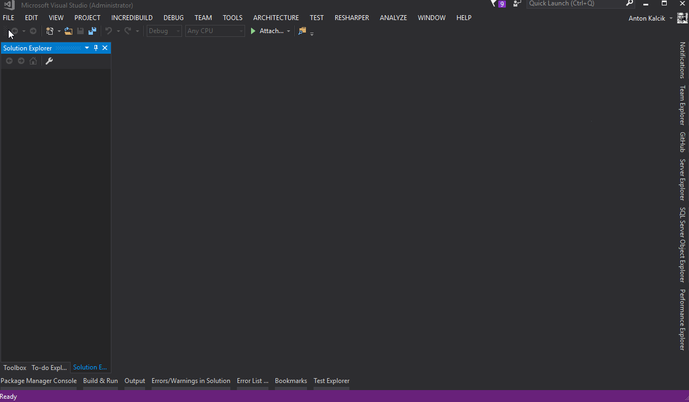
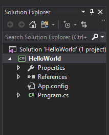

# "Hello World" in Visual Studio

Du wirst nun dein erstes C# Programm entwickeln. Dazu wirst du benötigen eine Entwicklungsumgebung. Wir empfehlen dir ein Visual Studio Community von Microsoft. Diese ist nun kostenlos und kann [hier](https://www.visualstudio.com/) heruntergeladen werden.

## Neue Solution
Programme in C# werden typischerweisse in sogennante Solutions organisiert. Jede Solution kann ein oder mehrere Projekte haben. Lege eine Solution _"HelloWorld"_. Siehe dazu das Video unten.



Nach dem die Solution erzeugt geworden ist solltest du folgende Struktur in Solution Explorer sehen:



Nun schreibst du jetzt dein eigenes Program. Es geht darum das Program in [```Program.cs```](src/HelloWorld/HelloWorld/Program.cs) so zu erweitern dass nach dem Start
"Hello World!" in console erscheint.

```csharp
using System;
using System.Collections.Generic;
using System.Linq;
using System.Text;
using System.Threading.Tasks;

namespace HelloWorld
{
    class Program
    {
        static void Main(string[] args)
        {
        }
    }
}
```
In C# gibt es eine Methode ```Console.WriteLine``` mit der man beliebige Text auf dem Bildschirm ausgeben kann. Das untere Beispiel gibt das Text _"Hello World!"_ aus.

```csharp 
Console.WriteLine("Hello World!")
```
Jetzt das komplette Program:

```csharp
using System;
using System.Collections.Generic;
using System.Linq;
using System.Text;
using System.Threading.Tasks;

namespace HelloWorld
{
    class Program
    {
        static void Main(string[] args)
        {
            Console.WriteLine("Hello World!")
        }
    }
}
```

Jetzt kannst du das Programm ganz einfach mit die Taste F5 starten. Du wirst jedoch sehen dass das Program zwar startet aber ziemlich schnell wieder beendet wird. Mann muss also noch eine Pause einbauen. Mit die Methode ```Console.ReadKey()``` wird dein Programm auf eine beliebige eingabe warten. Überlegt dir wo es sinn hat diese Methodenaufruf einzubauen.