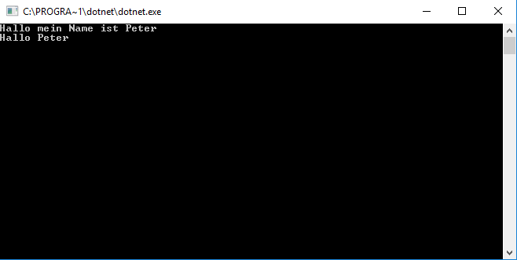

# Klassen

Stellt dir folgende Aufgabe vor. Du willst ein Adressbuch-Programm schreiben, mit welchem du Informationen über deine Freunde speichern kannst und zwar: 

* Name
* Geschlecht
* Spitzname
* Adresse
* Alter

## Klassen

Eine Klasse beschreibt ein Objekt, in diesen Fall eben einen bestimmten Freund oder eine Freundin.

Ein Klasse fängt immer mit einen Wort das sagt wo die Klasse überall sichtbar ist. Wir werden für's erste immer das Schlüsselwort ```public``` verwenden. Danach folgt das Schlüsselwort ```class```, womit wir dem Compiler sagen, dass wir nun eine Klasse definieren wollen.

```csharp
public class Freund {}
```

### Konstruktor
Eine Klasse kann auch einen oder mehreren expliziten Konstruktor(en) haben. Ein Konstruktor ist eine spezielle Methode welche genau dann aufgerufen wird, wenn ein konkretes Objekt einer Klasse erzeugt wird. In C# hat ein Konstruktor immer den Namen seiner Klasse und kann beliebige Parameter haben. Kontruktoren haben aber niemals einen Rückgabewert. 

```csharp
public class Freund 
{
    public Freund(){} // Ein Konstruktor ohne Parameter
    public Freund(string name) {} // Ein Konstruktor mit einem Parameter
}
```

### Klassenvariablen
Klassenvariablen sind Variablen die man innerhalb einer Klasse verwenden kann. Deshalb werden wir diese mit dem Schlüsselwort ```private``` versehen. Um eine Variable auch von ausserhalb der Klasse sichtbar zu machen können wir wieder das Schlüsselwort ```public``` verwenden.

```csharp
public class Freund 
{
    private DateTime geburtstag;
}
```

### Eigenschaften
Wir haben also eine Klasse erzeugt, aber es fehlen uns noch die Eigenschaften, welche deinen Freund beschreiben. Eigenschaften werden in C# _Properties_ genannt. Eine _Property_ fängt genauso mit einen Wort mit dem die Sichtbarkeit angegeben wird. Außerdem müssen wir natürlich den Datentyp angeben, damit begrenzen wir welche Werte die Eigenschaft annehmen kann. Zu letzt kommt der Name mit den wir das _Property_ ansprechen und die Schlüsselwörter ```get``` und ```set```.

```csharp
public class Freund 
{
    public string Name { get; set; }
} 
```

### Methoden
Klassen können auch Methoden haben, mit oder ohne Rückgabewert. Ein Rückgabewert kann als ein Ergebnis der Methode betrachtet werden.

Eine Methode ohne Rückgabewert ist folgend deklariert. Ein Sichtbarkeitswort gefolgt vom Schlüsselwort ```void```. Innerhalb der geschwungene Klammern, schreibt man dann das, was die Methode machen sollte.

```csharp
public class Freund 
{
    public void SagHallo()
    {
        Console.WriteLine("Hallo");
    }
}
```

Eine Methode kann, wie auch bereits ein Konstruktor, mehrere Eingabeparametern haben.

Hat eine Methode einen Rückgabewert, so gibt man dessen Datentyp anstatt des Schlüsselwort ```void``` an. Es muss immer ein Rückgabewert geliefert werden. Innerhalb der Methode gibt man diesem mit dem Schlüsserwort ```return``` an. Wird ```return``` ausgeführt beendet das gleichzeitig die Methode.

```csharp
public class Freund 
{
    public int SagMirDeinAlter()
    {
        return 25;
    }
}
```

Du hast jetzt einige Grundinformationen zu Klassen bekommen. Sehen wir uns jetzt gemeinsam an, wie man Klassen verwenden kann.

Zuerst deklarieren wir die Klasse ```Freund```:

```csharp
public class Freund 
{
    public Freund(string name)
    {
        Name = name;
    }
    public string Name { get; set; }

    public int Alter { get; set; }

    public void SagHallo()
    {
        Console.WriteLine("Hallo mein Name ist " + Name);
    }
}
```
Um diese Klasse zu verwenden, müssen wir diese Klasse instanziieren. Das machen wir mit den _Operator_ ```new```.

```csharp
public class Program
{
    public class Freund 
    {
        public string Name { get; set; }

        public int Alter { get; set; }

        public void SagHallo()
        {
            Console.WriteLine("Hallo mein Name ist " + Name);
        }
    }

    static void Main(string[] args)
    {
        Freund meinFreund = new Freund();
    }
}
```

Ab jetzt können wir mit die Variable ```meinFreund``` verwenden. Wir können zum Beispiel den Eigenschaften _Name_ und _Alter_ der Instanz ```meinFreund``` einen Wert zuweisen.

```csharp
class Program
{
    public class Freund 
    {
        public Freund(string name)
        {
            Name = name;
        }
        public string Name { get; set; }

        public int Alter { get; set; }

        public void SagHallo()
        {
            Console.WriteLine("Hallo mein Name ist " + Name);
        }
    }

    static void Main(string[] args)
    {
        Freund meinFreund = new Freund("Peter");
        meinFreund.Alter = 8;
    }
}
```

Lassen wir uns doch von unserem Freund begrüßen, dessen Informationen in der Instanz ```meinFreund``` gespeichert sind und lass uns den Gruß erwidern.

```csharp
class Program
{
    public class Freund 
    {
        public Freund(string name)
        {
            Name = name;
        }
        public string Name { get; set; }

        public int Alter { get; set; }

        public void SagHallo()
        {
            Console.WriteLine("Hallo mein Name ist " + Name);
        }
    }

    static void Main(string[] args)
    {
        Freund meinFreund = new Freund("Peter");
        meinFreund.Alter = 8;

        meinFreund.SagHallo();
        Console.WriteLine("Hallo " + meinFreund.Name);
    }
}
```

Wenn wir das Programm ausführen sieht das Ergebniss so aus:


## Aufgabe

* Vervollständige die Klasse mit weiteren Eigeschaften wie _Geschlecht_, _Spitzname_ und _Adresse_. 
* Erweitere die Methode ```SagHallo```, damit die neuen Eigenschaften ebenfalls berücksichtigt werden. Zum Beispiel so: "Hallo ich heiße _Name_ und bin _Alter_ alt. Meine Freunde nennen mich auch _Spitzname_." Falls keine _Spitzname_ vorhanden ist, sollte der letzte Satz natürlich nicht ausgegeben werden.
* Initializiere die Klasse mit einem Konstruktor, welcher die Eigenschaften _Geschlecht_, _Spitzname_ und _Alter_ als Parameter akzeptiert.
* Benutze die Klasse in einem Program und gib die Informationen mit hilfe der Methode ```SagHallo``` auf der Console aus.