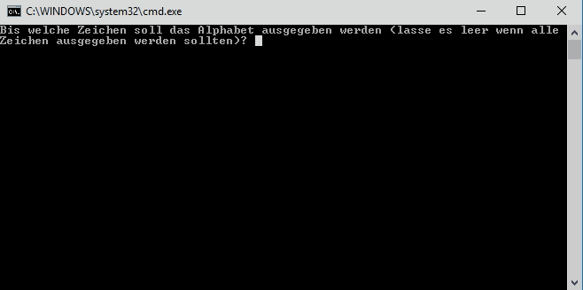

# Schleifen

Wenn du einen bestimmten Teil deines Programms öfter ausführen möchtest, dann kannst du das zum Beispiel mit einer Schleife machen. Es gibt verschiedene Arten von Schleifen mit denen du unterschiedliche Arten von Wiederholungen besser lösen kannst.


## While

Die ```while```Schleife ermöglicht es dir am Beginn eines Codeblocks eine Bedingung anzugeben mit welcher festgelegt wird ob der Codeblock ausgeführt wird. Da die Bedingung am Beginn, oder auch dem Kopf, des Codeblocks steht ist es auch möglich dass der Codeblock gar nicht ausgeführt wird. Die ```while``` Schleife wird deshalb auch als sogenannte kopfgesteuerte Schleife bezeichnet.

```csharp
int anzahlVonZeichen = 0;
while (anzahlVonZeichen < 10)
{
    Console.Write("X");
    anzahlVonZeichen++;
}
```

Im Unterschied zu ```for```, hat die ```while``` Schleife nur ein Befehl. Diese sagt wie lange soll das Codesegment ausgeführt werden. In den obigen Beispiel lautet das Abbruchbedienung ```anzahlVonZeichen < 10```. Also wird das Befehl ``` Console.WriteLine ``` solange ausgeführt bis das ```anzahlVonZeichen``` kleiner zehn ist. Vielleicht fragst du dich was das Befehlt ```anzahlVonZeichen++``` bedeutet. Es ist eine Abkürkzung von einer Schreibweisse ```anzahlVonZeichen = anzahlVonZeichen + 1```.

Eine Frage: Wieviel _X_ Zeichen werden auf dem Bildschirm in den obigen Beispiel tatsächlich ausgegeben? 

### Aufgabe

Vervollständige das Code hier so dass man ein Alphabet ausgeben kann. Man kann jedoch begrenzen wie viel Zeichen man ausgeben möchte in dem man das 'bis' Zeichen eingibt.

```csharp
static void Main(string[] args)
{
    char[] alphabet = new char[]
                        {
                            'a', 'b', 'c', 'd', 'e', 'f', 'g', 'h', 'i', 'j', 'k', 'l', 'm', 'n', 'o', 'p', 'q', 'r', 's', 't', 'u', 'v', 'w', 'x', 'y', 'z', 'ä',  'ö',  'ü', 'ß'
                        };

    Console.Write("Bis welche Zeichen soll das Alphabet ausgegeben werden (lasse es leer wenn alle Zeichen ausgegeben werden sollten)? ");
    char zeichen = Console.ReadKey().KeyChar;
    Console.WriteLine();

    int i = 0;

    //schreibe hier das Codesegment um das Alphabet auszugeben mit hilfe eine while Schleife

    Console.WriteLine();
}

```

Das Programm könnte so aussehen


Es gibt auch eine Fußgesteuerte Variante einer ```while``` Schleife. Die siete so aus:

```csharp
int anzahlVonZeichen = 0;
do
{
    Console.Write("X");
    anzahlVonZeichen++;
}
while (anzahlVonZeichen < 10)
```
In diesen Fall wird die Schleife immer mindestens einmal ausgeführt weil die Abbruchbedienung erst am ende, also beim Fuß der Schleife überprüft wird.


## For

Eine ```for``` Schleife ist sogenannte Zählschleife und besteht aus drei Befehlen. Der erste Befehl bestimmt das Wert und ein Typ von _Index_. Der zweite Parameter ist eine Abbruchbestimmung. Er steuert wann die Schleife abgebrochen werden soll. Der dritte Befehlt sagt welche Operation sollte nach jedem Vorgang ausgeführt werden.

Sehen wir uns wie so eine Schleife aussieht an :

```csharp
for (int i = 0; i < 4; i = i + 1)
{
    Console.WriteLine(i);
}
```

Der erste Befehl weißt einer Variable ```i``` von Typ ```int``` ein Anfangswert von 0 zu. Die Abbruchbestimmung sagt das die Schleife so lange bis das ```i``` kleiner vier ist, ausgeführt werden soll. Der letzte Parameter ist typischerweiße dazu benötigt das Wert in ```i``` zu erhöhen wie auch in diesen Beispiel. Nach jedem Durchgang wird das Wert um eins erhöht. 

Eine Frage: Welche Werte werden nach Ausführung in _Console_ angezeigt?

### Aufgabe
 1) Schreibe in einer Variable ```string[] freunde``` die Namen fünf Freunde oder Freundinnen. Gib nacheinander alle Namen in _Console_ aus, indem du die ```for``` Schleife verwendest.

 2) Gib die alle Namen in umgekehrte Reihenfolge aus.


## Foreach

Eine ```foreach``` Schleife ist eine Mengenschleife, weil sie immer auf alle Elemente einer Menge ausgeführt wird.

```csharp
List<string> freundenNamen = new List<string>
                                {
                                    "Toni",
                                    "Daniel",
                                    "Peter"
                                };

foreach (string name in freundenNamen)
{
    Console.WriteLine(name);
}
```
Hier werden alle daten die in ```freundenNamen``` Liste gespeichert sind, ausgegeben. Man hätte es auch mit eine ```for``` Schleifen machen können aber das wäre aufwändiger.

```csharp
List<string> freundenNamen = new List<string>
                                {
                                    "Toni",
                                    "Daniel",
                                    "Peter"
                                };

for (int i = 0; i < freundenNamen.Count; i++)
{
    Console.WriteLine(freundenNamen[i]);
}
```

Eine ```foreach``` Schleife kann man jedoch nicht auf alle Datentypen verwenden.

### Aufgabe

Schreibe in einer Variable ```List<string> freunde``` die Namen fünf Freunde oder Freundinnen. Gib nacheinander alle Namen in _Console_ aus, indem du die ```foreach``` Schleife verwendest.