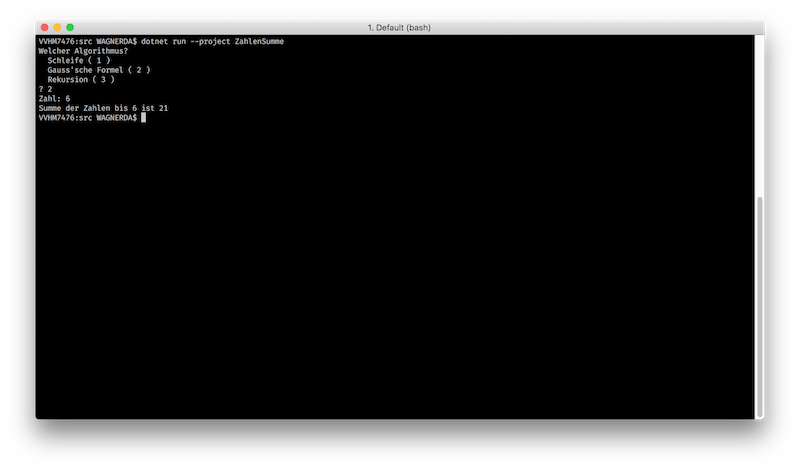

# "Summe von Zahlen"

In diesem Beispiel wirst du verschiedene Algorithmen entwickeln mit welchen die Summe von natürlichen Zahlen berechnet werden kann. Dabei wirst du auch einige Konzepte der Programmierung mit C# kennen lernen, wie zum Beispiel _Interfaces_, _Enums_ und _Rekursion_.

## Neues .NET Core Projekt
Zu Beginn lege dir ein neues .NET Core Projekt an. Dazu kannst du in einer Konsole folgende Befehle ausführen. Du kannst in der [Dokumentation der .NET Core CLI Tools][dotnet-cli-tools] nachlesen was die einzelnen Befehle bewirken.

```shell
mkdir ZahlenSumme
cd ZahlenSumme
dotnet new sln -n ZahlenSumme
dotnet new console -n ZahlenSumme
dotnet sln add ZahlenSumme/ZahlenSumme.csproj
```

### Das Hauptprogramm

Im Hauptprogramme (Klasse ```Program```) kannst du die Ein- und Ausgabe vorbereiten. Du benötigst eine Variable in welcher die Art der Berechnung gespeichert wird, eine weitere Variablen in welchen die Zahl bis zu welcher summiert werden soll bzw. die errechnete Summe gespeichert werden.

Für die Art des Algorithmus ist es vorteilhaft einen ```enum``` zu verwenden. Enums sind ein selbst definierter Datentyp in welchem bestimmten erlaubten Werten einen Namen geben kannst. In der [Dokumentation][dotnet-csharp-enum] kannst du mehr zu ```enum```s nachlesen.

Hier ein Beispiel wie ein ```enum``` aussieht:
```csharp
enum Obst
{
    Apfel = 1,
    Birne = 2,
    Zwetschke = 3
}
```

Der Vorteil des ```enum``` wird beim benötigten ```switch``` sichtbar. Da unser ```enum``` nur eine abzählbare Anzahl an möglichen Werten hat, können wir diese bei einem ```switch``` auch alle angeben um den ausgewählten Algorithmus auch zu erzeugen. Ein Beispiel wie du ```enum``` zusammen mit ```switch``` verwendest siehst du hier:


```csharp
Obst meinObst = (Obst)Convert.ToInt32(Console.ReadLine());

switch (meinObst)
{
    case Obst.Apfel:
        Console.WriteLine("Apfel");
        break;

    case Obst.Birne:
        Console.WriteLine("Birne");
        break;

    case Obst.Zwetschke:
        Console.WriteLine("Zwetschke");
        break;
}
```

### Die Algorithmen

Für dein Programm benötigst du noch die verschiedenen Berechnungsalgorithmen. Sie haben alle etwas gemeinsam, das können wir auch in C# ausdrücken. Für dieses Beispiel verwenden wir dazu ein ```interface``` Algorithmus  in dem du beschreibst was eine ```class``` anbieten muss um von unserem Hauptprogramm als Algorithmus verwendet werden zu können.

Ein ```interface``` für zweidimensionale geometrische Formen kann zum Beispiel so aussehen:

```csharp
public interface I2dFlaeche
{
    int Umfang();

    int Flaeche();
}
```

Dieses ```interface``` beschreibt dass eine Form welche das Interface implementiert, zwei Methoden anbieten muss mit denen man den Umfang und die Fläche berechnen kann. Wenn du nun einen Kreis als ```class``` definierst, kannst du so angeben dass dieser unser ```interface``` anbietet:

```csharp
public class Kreis : I2dFlaeche
```

Du kannst nun ein ```interface``` erzeugen in dem du beschriebst welche Methoden ein Algorithmus in unserem Beispiel anbieten muss und dann noch für jeden Algorithmus eine ```class``` welche diese dann auch konkret implementiert.

Die Ausgabe des fertigen Programms sieht dann zum Beispiel so aus:


[dotnet-cli-tools]: https://docs.microsoft.com/en-us/dotnet/core/tools/?tabs=netcore2x
[dotnet-csharp-enum]: https://docs.microsoft.com/en-us/dotnet/csharp/language-reference/keywords/enum
[dotnet-csharp-interface]: https://docs.microsoft.com/en-us/dotnet/csharp/language-reference/keywords/interface
