# Arbeiten mit dem Beschleunigungssensor auf dem micro:bit

## Was ist ein micro:bit?

Solltest Du die Einführung zum micro:bit noch nicht gelesen haben, findest Du sie [hier][1]

## Wie messe ich die Beschleunigung?

Öffne den [makecode][2] Editor.

Zuerst benötigen wir ein Ereignis, das dem micro:bit sagt, wann er etwas tun soll. In diesem Fall ist es die Eingabe: Wenn (geschüttelt)

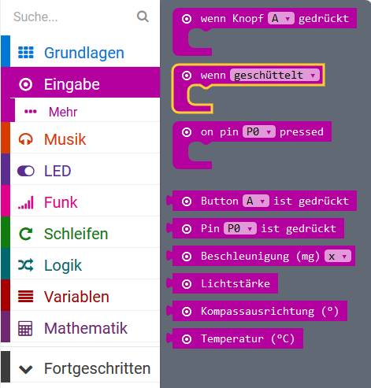

Verschiebe den Block in den Arbeitsbereich.

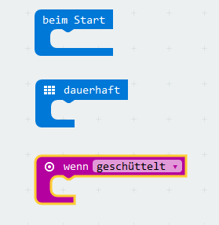

Wir wollen feststellen, wie stark der micro:bit geschüttelt wurde. Dazu benötigen wir als nächstes eine Variable in der wir die Stärke festhalten können innerhalb unserer Wenn Anweisung.

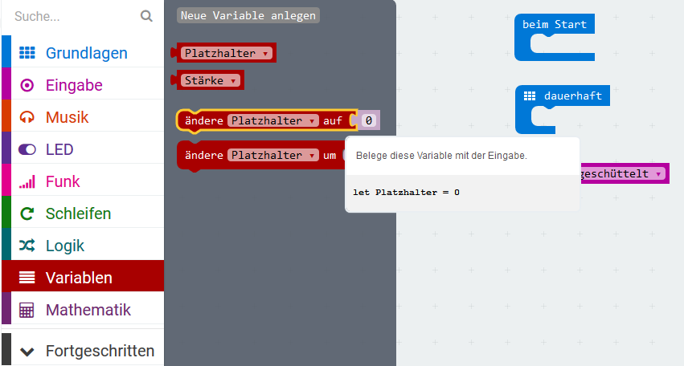

Etwa so

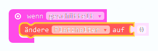

Nun müssen wir nur noch die Variable umbenennen - "Platzhalter" ist nicht besonders aussagekräftig - oder? Klick auf den kleinen Pfeil neben dem "Platzhalter" und wähle "Variable umbenennen" aus. 

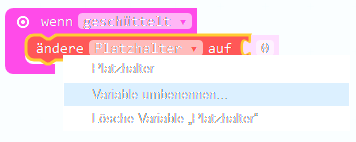

Wir nennen die Variable "Stärke"

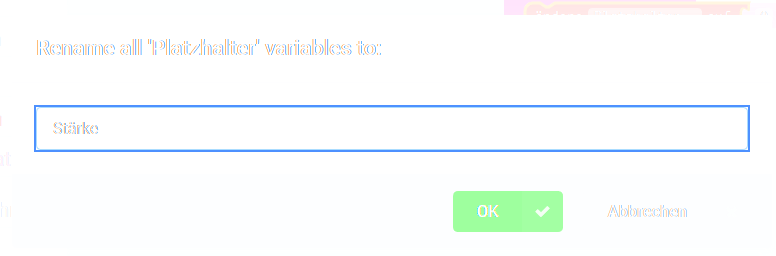

Jetzt müssen wir der Variable zuweisen, wie stark der micro:bit geschüttelt wird

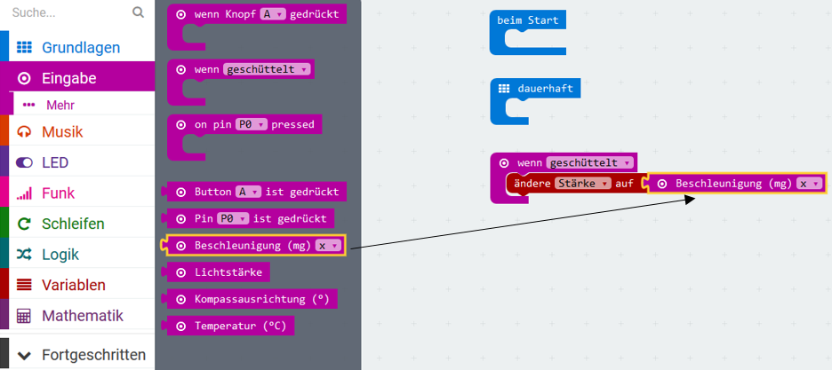

Als Wert wählen wir "Stärke" aus

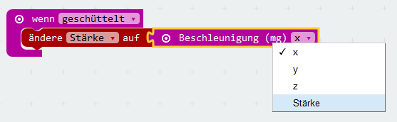

Als nächstes wollen wir noch ausgeben, wie stark der micro:bit geschüttelt wurde. Dazu verwenden wir "Zeige Zeichenfolge" aus den "Grundlagen". (Wenn Du mit der Maus über dem Block "Zeige Zeichenfolge" bleibst, wird eine kurze Hilfe angezeigt. Lies Dir den Text gut durch, das wird gleich noch wichtig!)

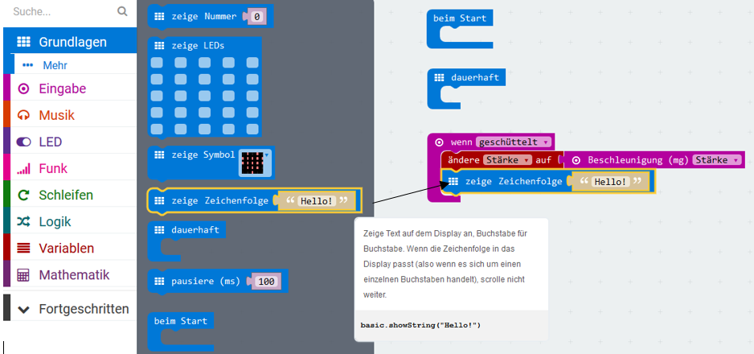

Jetzt wählen wir unsere Variable Stärke aus und ziehen sie hinter den Block "Zeige Zeichenfolge"

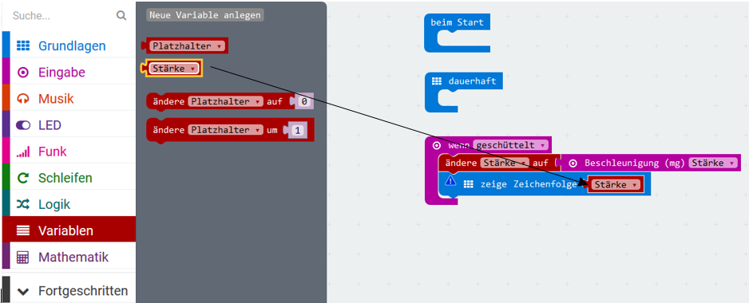

Hier hat sich aber jetzt ein Fehler eingeschlichen, der uns durch das kleine blaue Rufzeichen angezeigt wird. 

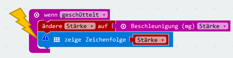

Was ist da passiert? Wenn wir auf das Rufzeichen klicken, erfahren wir mehr:

Was bedeutet das? Wir haben versucht den Wert von unserer Variable "Stärke" die eine Zahl enthält in dem Text von "Zeige Zeichenfolge" auszugeben. Der Text von Zeige Zeichenfolge, erwartet aber immer einen Text und kann mit Zahlen nichts anfangen. Programmierer nennen dieses Problem einen "Type Mismatch".
Aber wie beheben wir dieses Problem?

Zum Glück können wir den Zahlenwert so ändern, dass er von "Zeige Zeichenfolge" verstanden werden kann. Dazu müssen wir aber zunächst in den JavaScript Code wechseln.

Das tun wir, indem wir auf den {}JavaScript button rechts oben klicken:

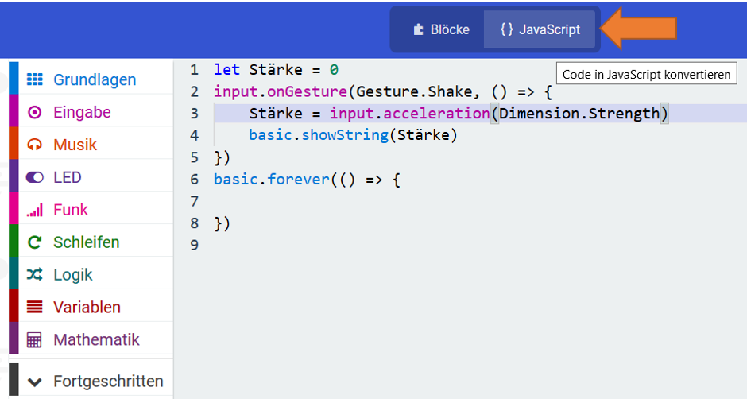

Jetzt fügen wir in den bestehenden Code eine neue Zeile ein. Und zwar *let Stärke_Str = Stärke.toString()*
Damit definieren wir eine neue Variable "Stärke_Str" und weisen ihr den Wert von "Stärke" zu nachdem wir diesen mit der Funktion "toSring()" in einen String umgewandelt haben.

Zusätzlich müssen wir nun in der Funktion "basic.showString(Stärke)" die Variable "Stärke" durch unsere neue Variable "Stärke_str" ersetzen.

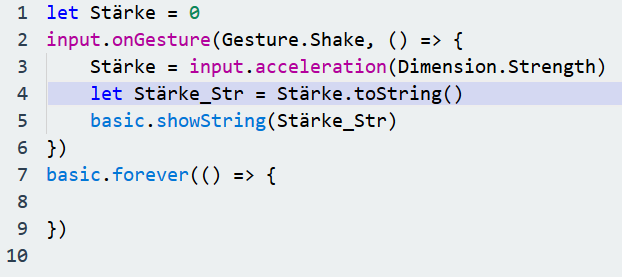

Alles Fertig? Dann kann's losgehen! Probieren wir den Code aus!

## Übertrage den Code auf ein micro:bit

Schliesse das micro:bit am Computer an. Der micro:bit sollte am Computer als ein Laufwerk erscheinen.

Nun müssen wir den Code herunterladen. Entweder speicherst du den Code direkt auf dem micro:bit Laufwerk oder du speicherst es auf deinem Computer und verschiebst es dann auf das micro:bit.

Wenn du den Code (eine hex Datei) auf dem micro:bit speicherst, beginnt der _Flashvorgang_, also das Programm wird in den micro:bit Speicher übertragen bzw. _geflasht_.

Nach dem _Flashvorgang_ kannst Du den micro:bit schütteln und er sollte Dir Zahlenwerte auf dem LED Matrix Display ausgeben - je nachdem wie stark er geschüttelt wurde.

Beobachte welche Werte Du angezeigt bekommst.

[1]: ../Hello_World/Readme.md
[2]: https://makecode.microbit.org