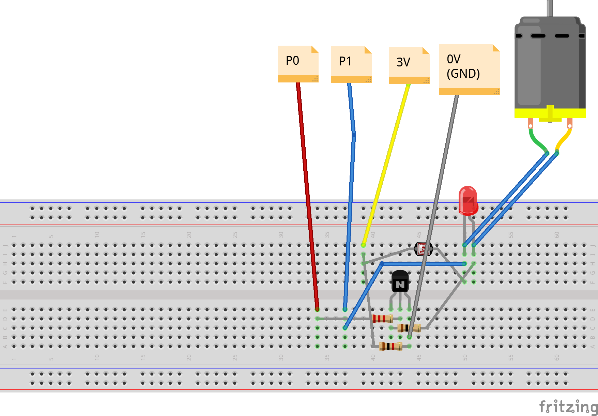

# Microbit Steuerung
## Steuerung eines Ventilators mittels PWM

### Funktion

Mittels eines Transistors wird mit geringen Ausgangsspannung des Micro:Bit der Weg für eine stärkere Spannung frei gemacht bzw. geschlossen. Ein Transistor lässt sich mit einer kleinen Spannung öffnen bzw. schliessen und kann so einen angeschlossenen Motor steuern. Wird der Transistor hintereinander geöffnet und geschlossen entstehen 3V Pulse welche den Motor antreiben. Je länger ein Puls dauert desto schneller dreht der Motor. Ebenso beim angeschlossenen LED. Je länger ein 3V Puls dauert, desto heller leuchtet die Diode.
Diese dauer wird als **Pulsweite** bezeichnet. Die Veränderung als **Pulsweitenmodulation** PWM.
Diese spielt in vielen Schaltungen eine wichtige Rolle siehe auch Artikel in [Wikipedia](https://de.wikipedia.org/wiki/Pulsweitenmodulation)

### Aufbau
Das folgende Diagramm zeigt den Aufbau der dazugehörigen Schaltung.



### Code

Die Datei [microbit-fancontroller.js](src/microbit-fancontroller.js) enthält das JavaScript für den [Microsoft Block Editor](https://makecode.microbit.org/)

Die eigentliche Steuerung der Motorgeschwindigkeit passiert in der Funktion `spinUp()` mittels:
```
DutyCycle = 0
    while (DutyCycle <= 1023) {
        pins.analogWritePin(AnalogPin.P0, DutyCycle)
        DutyCycle += 1
        if (breakA) {
            break
        }
        basic.pause(10)
    }
```
Die Variable `DutyCylce` bezeichnet die Dauer eines 3V Impulses. Sie wird inkrementiert und mittels `pins.analogWritePin(AnalogPin.P0, DutyCycle)` auf Pin 0 ausgegeben.
Analog dazu wird in der Funktion `spinDown()` der DutyCycle graduell verkürzt.

Um die Sache interessanter zu steuern ist in der Schaltung auch ein Helligkeitssensor eingebaut. Wird der Sensor abgedeckt (dunkel) erscheint ein Mond und der Ventilator wird abgestellt. Wird es hell (Sonne) läuft der Ventilator an.
Diese Routing läuft im Hintergrund und liest den Pin 1 aus, an dem der Helligkeitswert des Sensors zwischen 0 (dunkel) und 1023 (hell) anliegt.

```
control.inBackground(() => {
    while (true) {
        light = pins.analogReadPin(AnalogPin.P1)        
```


