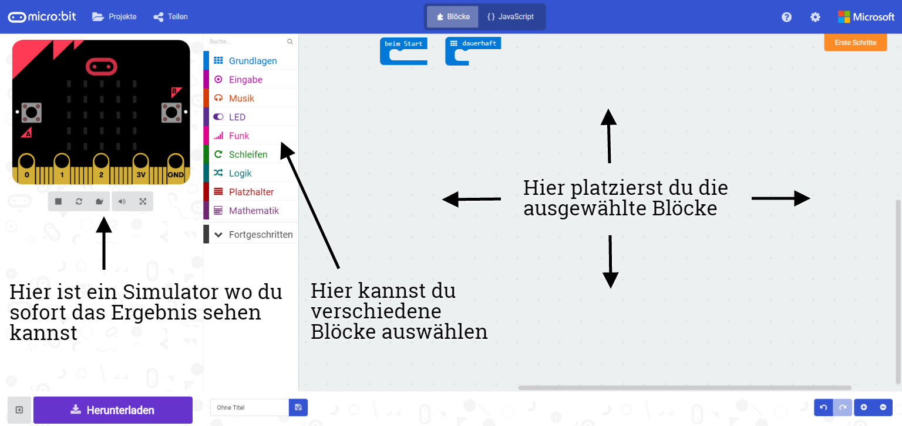
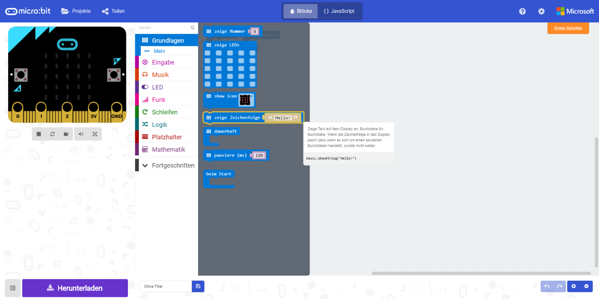
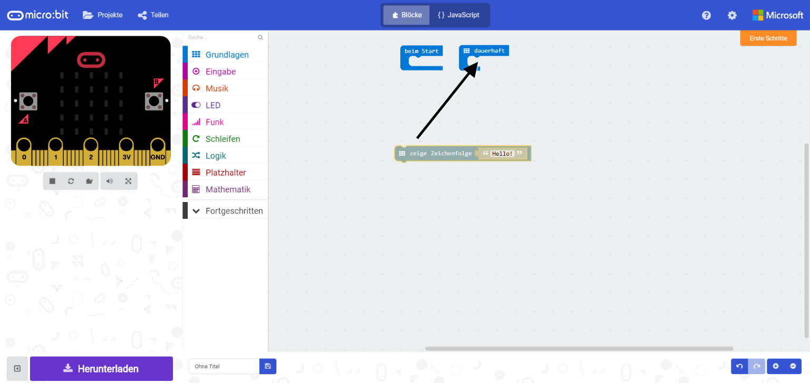
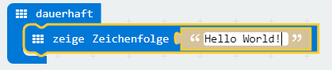
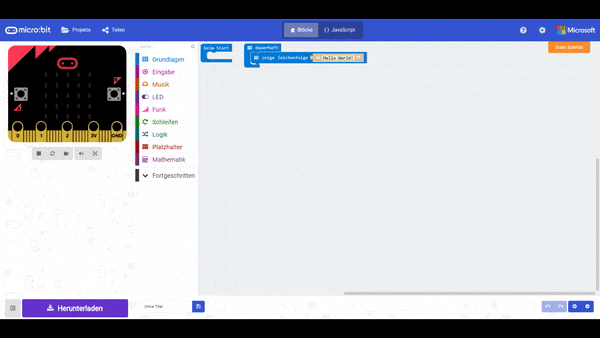
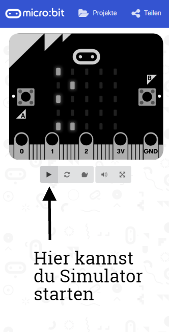
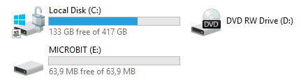
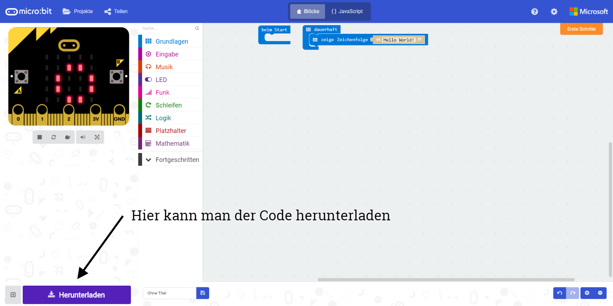
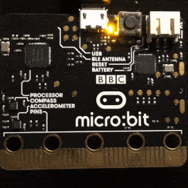

# Hello World mit micro:bit

## Was ist ein micro:bit

BBC micro:bit ist eine Kombination aus einem kleinen Mikrocontroller-Board mit mehreren Sensoren. So ist an den witzingen Board bereits ein Kompass, 3-Achsen-Beschleunigungssensor, Magnetometer, Bluetooth und ein 5x5 LED Matrizen mit zwei Knöpfen. Mehr über micro:bit kannst du zum Beispiel [hier][1] erfahren.

## Wie man micro:bit programmiert

Um micro:bit zu programmieren kann man mehrere Umgebungen nutzen:

* [makecode][2]
* [MicroPython][3]

Wir werden hier [makecode][2] verwenden.

## Hello World Beispiel programmieren

1. Öffne das [makecode][2] Editor.



2. Clicke in Blöcke auf _Grundlagen_ und wähle der Block ```zeige Zeichenfolge ''Hello!''``` aus.



3. Verschiebe der Block in ```dauerhaft```.



4. Verändere der Text innerhalb von ```zeige Zeichenfolge ''Hello!''``` Block auf _Hello World_.



Du solltest im Simulator sofort das Ergebnis sehen.




Ist das nicht der Fall, ist der Simulator nicht ausgeführt. Der Simulator kannst du mit dem _Simulator Starten_ Knopf wieder starten.



## Der Code auf echten micro:bit übertragen

1. Schliesse das micro:bit an Computer an. Der micro:bit sollte am Computer als ein Laufwerk erscheinen.



2. Lade der Code herunter. Entweder speicherst du dem Code direkt auf micro:bit Laufwerk oder du speicherst es an deinem Computer und verschiebt es auf micro:bit.



3. Wenn du dem Code (ein hex Datei) auf micro:bit speicherst, beginnt ein _flash_ vorgang ein, also das Programm wird in micro:bit Speicher übertragen.



4. Nach dem _flash_ Vorgang sollte das Ergebnis auf dem micro:bit erscheinen.


[1]: https://www.heise.de/make/artikel/Ausprobiert-Einplatinenrechner-BBC-Micro-Bit-3225054.html
[2]: https://makecode.microbit.org
[3]: http://python.microbit.org
