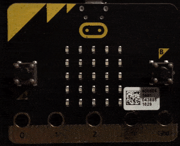

# Hello World mit micro:bit

## Was ist ein micro:bit

BBC micro:bit ist eine Kombination aus einem kleinen Mikrocontroller-Board mit mehreren Sensoren. Es hat einen Kompass, 3-Achsen-Beschleunigungssensor, Magnetometer, Bluetooth und eine 5x5 LED Matrize und zwei Buttons. Mehr über micro:bit kannst du zum Beispiel [hier][1] erfahren.

## Wie man micro:bit programmiert

Als micro:bit Entwicklungsumgebung gibt es verschiedene Werkzeuge:

* [makecode][2]
* [MicroPython][3]

Wir werden hier [makecode][2] verwenden.

## Programmiere ein 'Hello World' Beispiel

1. Öffne den [makecode][2] Editor.


2. Klicke in Blöcke auf _Grundlagen_ und wähle der Block ```zeige Zeichenfolge ''Hello!''``` aus.


3. Verschiebe den Block in ```dauerhaft```.


4. Verändere den Text innerhalb von ```zeige Zeichenfolge ''Hello!''``` Block auf _Hello World_.


Du solltest im Simulator sofort das Ergebnis sehen.


Ist das nicht der Fall, ist der Simulator nicht gestartet. Den Simulator kannst du mit dem _Simulator Starten_ Knopf wieder starten.


## Übertrage den Code auf ein micro:bit

1. Schliesse das micro:bit am Computer an. Der micro:bit sollte am Computer als ein Laufwerk erscheinen.


2. Nun müssen wir den Code herunterladen. Entweder speicherst du den Code direkt auf dem micro:bit Laufwerk oder du speicherst es auf deinem Computer und verschiebst es dann auf das micro:bit.


3. Wenn du den Code (eine hex Datei) auf dem micro:bit speicherst, beginnt der _Flashvorgang_, also das Programm wird in den micro:bit Speicher übertragen bzw. _geflasht_.


4. Nach dem _Flashvorgang_ sollte das Ergebnis auf dem micro:bit erscheinen.




[1]: https://www.heise.de/make/artikel/Ausprobiert-Einplatinenrechner-BBC-Micro-Bit-3225054.html
[2]: https://makecode.microbit.org
[3]: http://python.microbit.org
