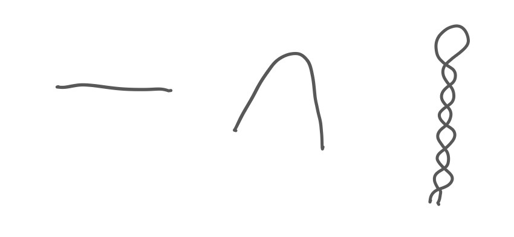
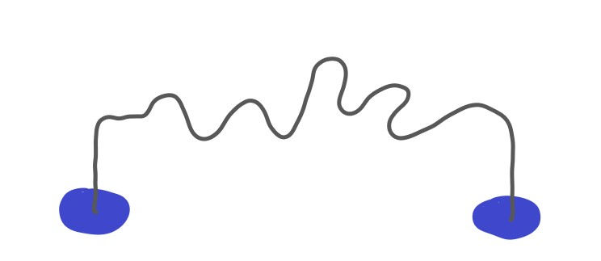
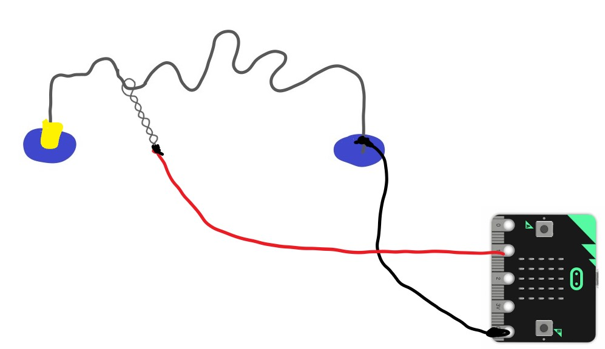
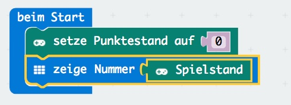
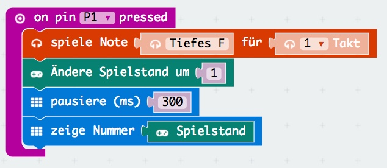
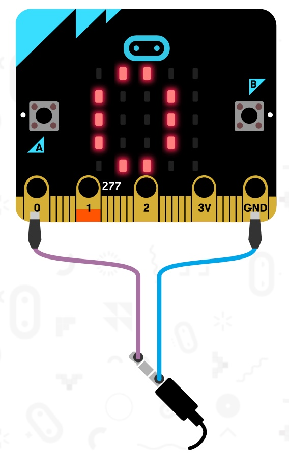

# HotWire - Der heisse Draht

Ist ein spiel wo du noch zusätzliche Dinge ausser dem micro:bit selbst benötigst:
- ca. 80 cm Draht davon ein Stück 50cm und ein Stück 30 cm
- 2 Kabel mit Krokodilklemmen
- 2 Stück Knetmasse oder Styropor
- optional: ein Lautsprecher oder Kopfhörer und nochmals 2 Kabel mit Krokodilklemmen

## Zuerst bauen wir etwas

Wir nehmen zuerst das kurze Stück draht, biegen es und verdrehen es, sodass ein Stab mit einer größeren Schlaufe entsteht (es sollte ca euer kleiner Finger hinein passen).

Das lange Stück Draht biegen wir mit ein paar Schleifen darin und stecken die Enden jeweils in ein Stück Knetmasse.

Zum Schluss fädeln wir den zuerst gebastelten Draht ein und befestigen noch ein Stück Isolierband am Startpunkt.
Dann schließen wir mit einer Krokodilklemme das Ende unseres Drahtes und das andere Ende an GND am micro:bit an.
Nun müssen wir nur noch den Stab mit einer Krokodilklemme anschließen und das andere Ende an 1 am micro:bit. 

## Das Programm

Beim Start müssen wir nur den Punktestand auf 0 setzen und den Spielstand anzeigen.

## wenn der Draht mit dem Stab berührt wird

Da wir den Stab an 1 angeschlossen haben, müssen wir auf P1 reagieren.
Wenn der Stab also den Draht berührt und somit den Stromkreis zu GND schließt machen wir folgendes:
Wir spielen einen Ton ab (wenn ein Lautsprecher oder Kopfhörer angeschlossen sind - siehe weiter unten)
Ändern den Spielstand um 1 und zeigen ihn an.

## Kein Ton?

Da der micro:bit normalerweise keinen eingebauten Lautsprecher hat, müssen wir entweder einen Lautsprecher mit 0 und GND an den micro:bit anschließen oder mit Krokodilklemmen ein Kopfhörer-klinken-Kabel folgendermaßen anschließen:

## weitere Ideen

- Spiele am Anfang eine kleine Melodie
- wenn zuviele Fehler gemacht werden zeige Game Over an
- verwende Isolierband um schwierige Passagen leichter zu machen
