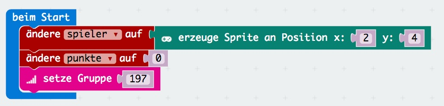
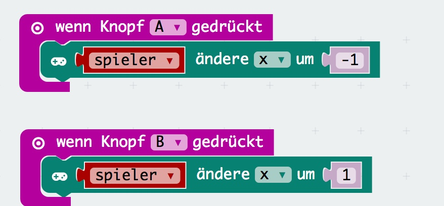
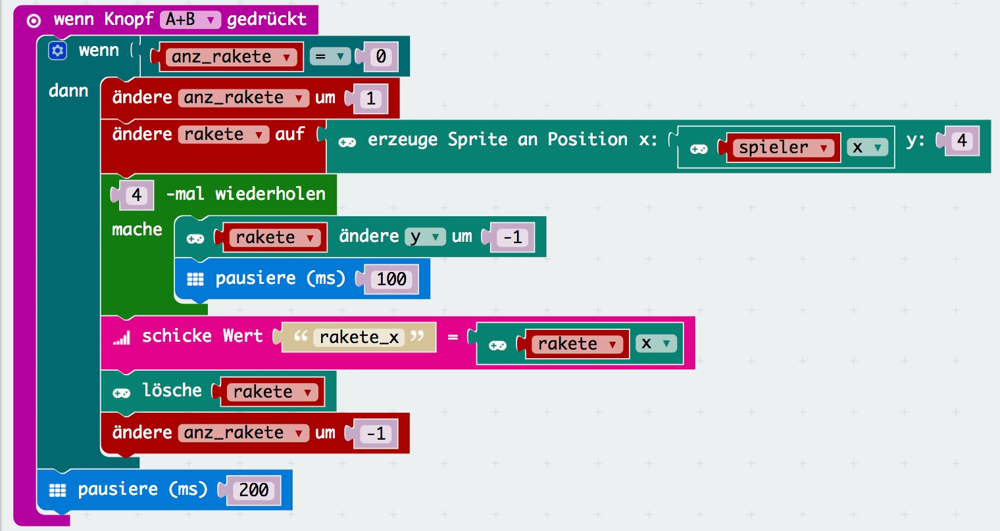
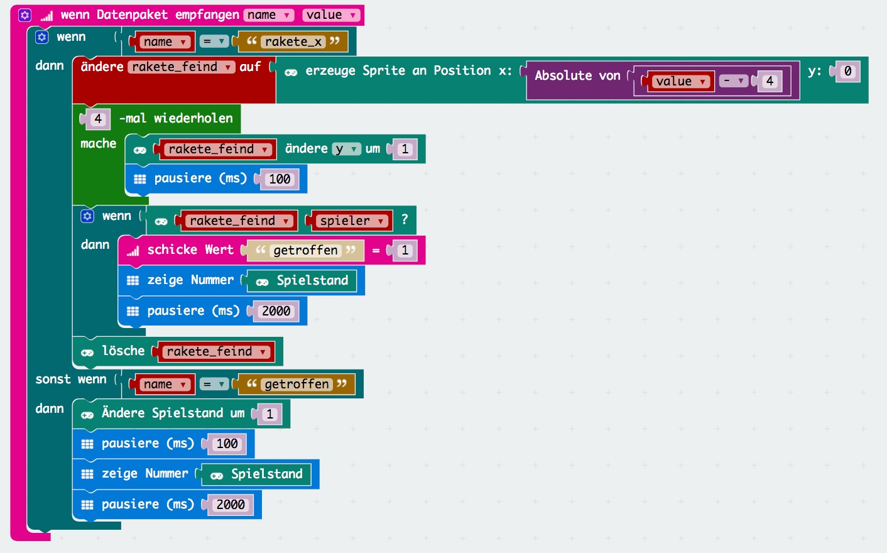

# Missile Shooter

In diesem Spiel für den micro:bit spielen 2 Spieler gegeneinander und versuchen sich zu treffen.
Der Code welchen wir schreiben wird für beide micro:bit verwendet.

## Beim Start

Erzeugen wir 2 neue Variablen: ```spieler``` und ```punkte```. Hierzu verwenden wir die Bausteine aus der Kategorie _Spiel_ um ein [Sprite][sprite-link] an der Position in der Mitte unten aufleuchten zu lassen.
Ausserdem musst du die Gruppe setzen über welche die micro:bit kommunizieren sollen, diese kannst du ganz nach belieben wählen.



## Bewegung

Um den Spieler nach links (-1) oder rechts (1) zu bewegen verändern wir wenn wir den passenden Knopf drücken die ```x``` Variable von ```Spieler```.



## Abschuss einer Rakete

Um eine Rakete zu schiessen, muss man A+B gleichzeitig drücken. Hierzu erzeugen wir ein neues Sprite an der Position des Spielers. Und bewegen die Rakete 4x nach oben (rakete - ändere y um -1). Danach schicken wir den x-Wert, also in welcher Spalte sich die Rakete befindet an den anderen micro:bit und löschen die Rakete vom Bildschirm. Nun ist sie von unserer Anzeige verschwunden und soll am anderen micro:bit wieder auftauchen.



## Die Rakete kommt auf uns zu

Wenn wir den x-Wert einer Rakete empfangen, erzeugen wir an der empfangenen Position (aber Seiteverkehrt zum 2. micro:bit) ein neues [Sprite][sprite-link] mit dem Namen ```rakete_feind```. Diese ```rakete_feind``` lassen wir 4x sich nach unten bewegen und fragen dann ab ob unser Spieler getroffen wurde. Falls ja, dann senden wir ```getroffen``` über das Netzwerk und zeigen den Spielstand an. Auf jeden fall können wir nun aber die ```rakete_feind``` wieder löschen.

Falls wir ```getroffen``` empfangen, müssen wir den Spielstand um 1 erhöhen und anzeigen bevor es weiter geht.



## Weitere Ideen

- Zeige den Gewinner nach 5 Treffern an
- was passiert wenn 3 oder mehr das Spiel gleichzeitig spielen?

[sprite-link]: https://de.wikipedia.org/wiki/Sprite_(Computergrafik)