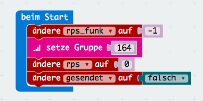
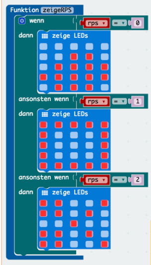
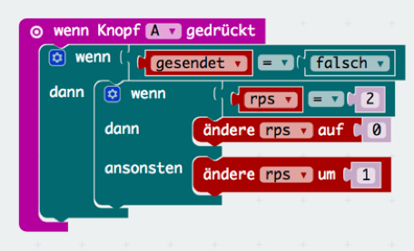
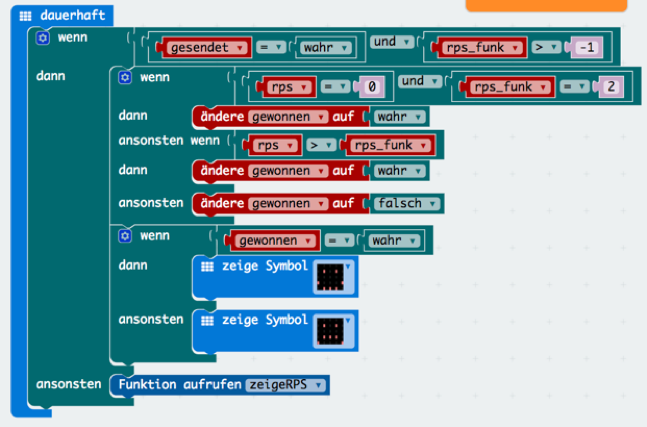
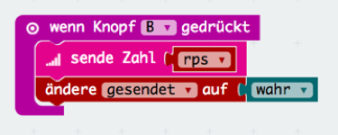
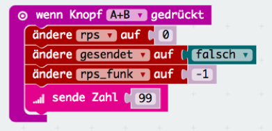
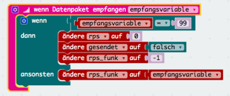

# Schere, Stein, Papier - Rock, Paper, Scissors (RPS)

In dieser Übung wirst du auf deinem micro:bit ein Spiel für 2 Spieler entwicklen, dass dem bekannten Schere, Stein, Papier entspricht.

## beim Start

Zuerst muss eine Radiogruppe angelegt werden über die sich die micro:bit unterhalten können (verwendet hier irgendeine Zahl, zb die 164). Außerdem verwenden wir ein paar Variablen die wir hier gleich einmal auf die Standartwerte setzten. Lege also folgende Variablen an:
Rps_funk
Rps
Gesendet

## zeigeRPS Funktion

Nun erstellen wir eine Funktion zwecks Übersichtlichkeit, in welcher die Bilder entsprechend den werten in der Variable rps angezeigt werden.
0 soll einen Stein darstellen, 1 soll ein Blatt Papier darstellen und 2 eine Schere.

## Knopf A

Immer wenn jemand den A Knopf drückt wollen wir das nächste Bild anzeigen. Wir müssen hierzu also lediglich die Variable rps um 1 ändern. Falls sie aber schon auf 2 steht dann ändern wie nicht auf 3 sondern zurück auf 0. Außerdem soll dies nur funktionieren solange wir noch nicht unsere Auswahl getroffen haben, also solange gesendet noch falsch ist.

## Dauerhaft 

So jetzt müssen wir das Bild aber auch mal anzeigen. Daher fügen wir in dauerhaft Funktion aufrufen zeigeRPS ein. Aber nur wenn wir noch nichts gesendet haben. Ausserdem müssen wir auch auswerten falls wir etwas gesendet und auch schon empfangen haben ob wir gewonnen oder verloren (gewonnen= false) haben.

## Knopf B

Nachdem wir ein Symbol ausgesucht haben, wollen wir dieses mit B an den anderen micro:bit senden.

## Knopf A+B

Wenn wir A+B gleichzeitig drücken, wollen wir alles zurücksetzen für ein neues Spiel und gleich dem anderen micro:bit auch diese Information senden.

## Datenpaket empfangen

Als nächstes wollen wir wissen falls jemand von einem anderen micro:bit etwas gesendet hat. Hierzu verwenden wir "wenn Datenpaket empfangen" und weisen sie der variable rps_funk zu.

## weitere Ideen

- finde alle "Bugs" und behebe sie
- was passiert bei einem Unentschieden?
- verwende "Rest von" für das Abfragen wer gewonnen hat