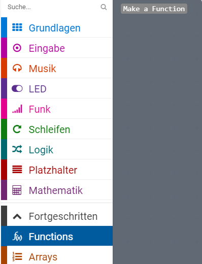
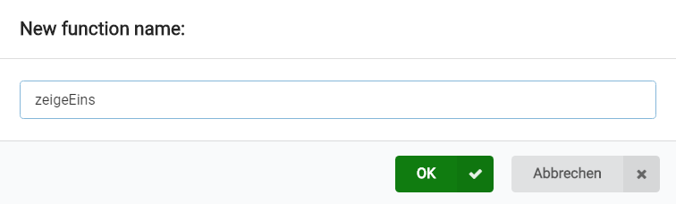
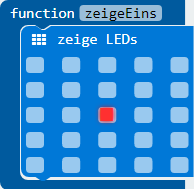
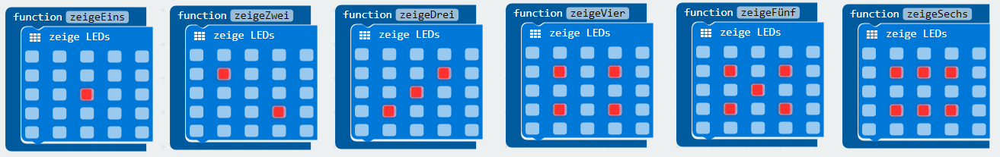

# Spielwürfel

Ziel dieses Übung ist ein Spielwürfel für micro_bit zu enwerfen.

## Funktionen für verschiedene Würfelzustände

Wir benötigen für jeden Würfelzustand eine Funktion. Mit Würfelzustand ist das gemeint, was nach jedem Wurf angezeigt wird.

Um eine Funktion zu erzeugen wähle  _Functions_ in _Fortgeschritten_ aus und dann _Make a Function_. Benenne die Funktion mit _zeigeEins_.





Die Funktion ```function zeigeEins``` soll ein Zahl _eins_ am Display von micro:bit zeigen. Dazu wähle in _Grundlagen_ das Baustein ```zeige LEDs``` aus und verschiebe diese in die ```function zeigeEins```. Zusätzlich markiere in mitte die Diode die aufleuchten soll.



Das selbe wiederhole für alle andere Würfelzustände.



## Würfeln

Der micro:bit kann mit seinem Beschleunigungssensor auf schütteln reagieren. Um dieses zu ermöglichen
wähle von _Eingabe_ ein Block ```wenn geschüttelt``` aus. Diese Block wird immer dann aufgerufen wenn der micro:bit geschüttelt wird.


Als nächstes muss du eine zufällige Zahl ermitteln. Das kannst    

