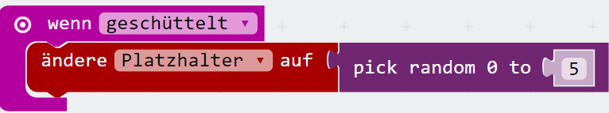
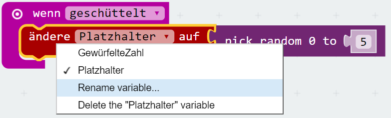
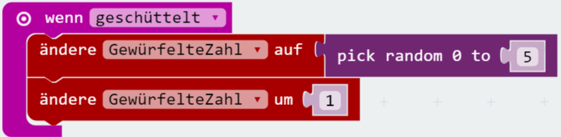
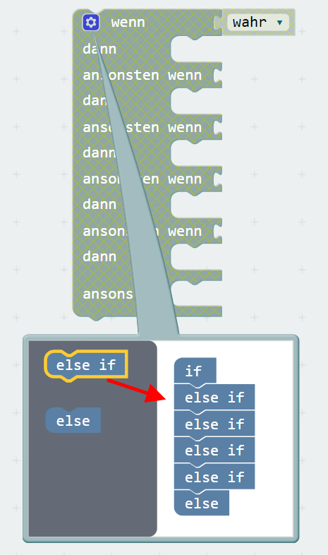
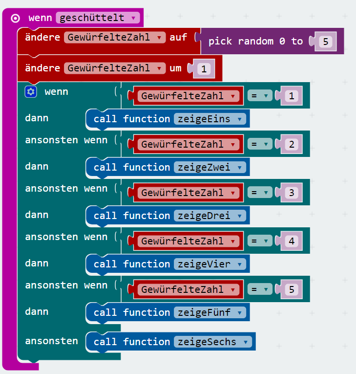
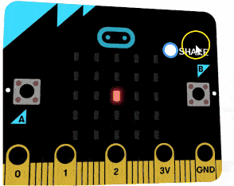
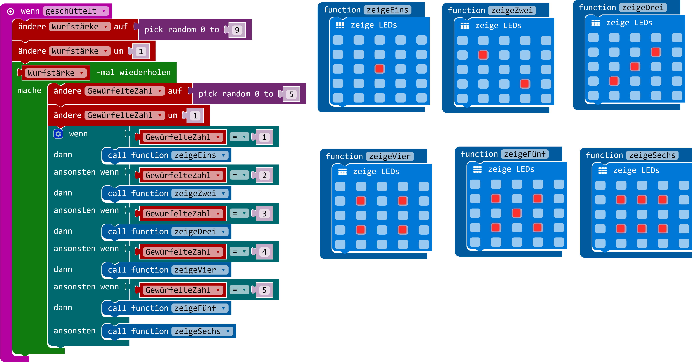

# Spielwürfel

Ziel dieses Übung ist ein Spielwürfel für micro_bit zu enwerfen.

## Funktionen für verschiedene Würfelzustände

Wir benötigen für jeden Würfelzustand eine Funktion. Mit Würfelzustand ist das gemeint, was nach jedem Wurf angezeigt wird.

Um eine Funktion zu erzeugen wähle  _Functions_ in _Fortgeschritten_ aus und dann _Make a Function_. Benenne die Funktion mit _zeigeEins_.


Die Funktion ```function zeigeEins``` soll ein Zahl _eins_ am Display von micro:bit zeigen. Dazu wähle in _Grundlagen_ das Baustein ```zeige LEDs``` aus und verschiebe diese in die ```function zeigeEins```. Zusätzlich markiere in mitte die Diode die aufleuchten soll.


Dasselbe wiederhole für alle andere Würfelzustände.


## Würfeln

Der micro:bit kann mit seinem Beschleunigungssensor auf schütteln reagieren. Um dieses zu ermöglichen
wähle von _Eingabe_ ein Block ```wenn geschüttelt``` aus. Diese Block wird immer dann aufgerufen wenn der micro:bit geschüttelt wird.


Als nächstes muss du eine zufällige Zahl ermitteln. Das kannst mit eine Funktion ```pick random``` verwenden. Bevor wir jedoch diese Baustein verwenden, benötigen wir eine Variable um das zufällige Zahl zu speichern. Um die Variable zu erzeugen gehe zu _Variablen_ und verschiebe der Baustein ```ändere Platzhalter auf 0``` ins Baustein ```wenn geschüttelt```. Dann nehme dazu von _Mathematik_ oben erwähnte ```pick random``` Baustein.



Schön wäre auch die Variable ```Platzhalter``` zum etwas verständlicheren umzubennen. Das kannst du machen wenn du auf das kleines Dreieck neben die Variable ```Platzhalter``` klickst und _Rename variable..._ wählst. Du kannst die Variable zum Beispiel ```GewürfelteZahl``` nennen.



Vielleicht ist dir aufgefallen dass das interval für zufällige  Zahl zwischen 0 und bei 5 liegt. Das kann auf dem ersten Blick merkwürdig sein. Aber wir können nun sechs mögliche Zahlen würfeln und wenn man bei null anfängt dann ist das höchste eben fünf. Um das Programm verständlicher und lesbar zu gestallten können wir ja die Variable ```GewürfelteZahl```um eins erhöhen.



## Zeige gewürfelte Zahl an

Das wird jetzt einfach. Um das gewürfelte Zahl anzuzeigen gehst du in _Logik_ und nimmst du der Baustein ```_wenn_dann_ansonsten```. Mit diesen Baustein hast du die Möglichkeit folgende Logik aufzubauen: Wenn das ```GewürfelteZahl``` eins ist, dann rufst du die Funktion ```zeigeEins```, für zwei dann die Funktion ```zeigeZwei``` usw. Jedoch es zu ermöglichen muss du das Baustein ```_wenn_dann_ansonsten``` ein bisschen modifizieren. 

Hol dir das Baustein ```_wenn_dann_ansonsten``` und klicke auf das kleine rädchen um diese Baustein zu verändern.



Jetzt wird das ```GewürfelteZahl``` mit einem erwarteten Zahl verglichen. Dazu holt man sich von _Logik_ das ```ist gleich``` Baustein. Auf die linke Seite setzt man die Variable ```GewürfelteZahl```ein auf die rechte das erwartete Wert. Diese setze man in den ```wenn_dann_ansonsten``` Baustein ein.
Von ```dann``` ruft man dann die jewalige Funktion mit ```call function``` von Menu _Functions_.



Wenn du jetzt auf das _Shake_ button in micro:bit Simulator clickst, solltest du jedensmal ein Wurfergebniss sehen.

## Aufgabe
Um es ein bisschen spannender zu machen, versuche das Programm so erweitern dass man während würfeln verschiedene Zahlen sehen kann. Genau als wenn eine Würfel auf dem Tisch rollt.



<a href="https://makecode.microbit.org/_UWyCsv6xEd8W" target="_blank" rel="some text"></a>