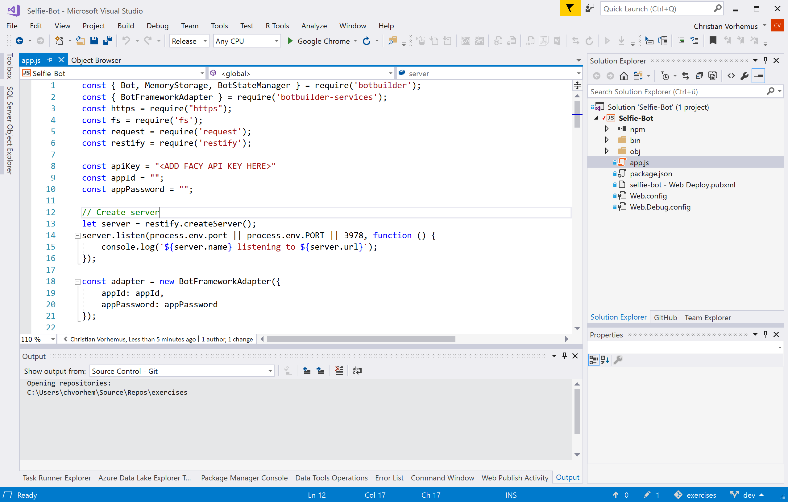

# Selfie-Bot
Dieser Bot wurde mit <a href="https://github.com/Microsoft/botbuilder-js" target="_blank">Microsoft Botbuilder SDK v4</a> in Node.js geschrieben. Er nimmt ein Bild/Selfie entgegen und ruft <a href="https://azure.microsoft.com/de-de/services/cognitive-services/face/" target="_blank">Microsoft Cognitive Services (Face API)</a> auf um das Bild zu analysieren hinsichtlich Geschlecht, Alter, Lächeln und Brille.

<p align="center">
  
</p>

## Los geht's!

Folgende Schritte sind notwendig um den Bot zu entwickeln:

### 1) Notwendige Installationen
Installiere die letzte Version von Visual Studio kostenlos von <a href="https://www.visualstudio.com/en/downloads" target="_blank">hier</a>. Als Workload sollten auf jeden Fall Node.js-Entwicklung und am besten auch ASP.NET-Entwicklung ausgewählt sein:

<p align="center">
  
</p>

Lade außerdem den <a href="https://github.com/Microsoft/BotFramework-Emulator/releases" target="_blank">Bot Emulator</a> für dein System herunter.

### 2) Keys abrufen
Wir verwenden Microsoft Cognitive Services um das Bild zu analysieren und benötigen dafür einen API-Schlüssel. Dazu wechseln wir auf <a href="https://azure.microsoft.com/de-de/try/cognitive-services/?api=face-api">diese Seite</a> und wählen "API-Schlüssel abrufen" aus.

<p align="center">
  
</p>

Ein Microsoft oder Facebook-Konto ist notwendig um den Schlüssel generieren zu können. Der Schlüssel ist danach als Zeichenkette abrufbar

<p align="center">
  
</p>

### 3) Projekt laden und starten
Lade dieses Projekt herunter und wechsle in den Ordner nodejs/Selfie-Bot, dort findest du die Datei Selfie-Bot.sln. Nachdem du Visual Studio installiert hast, kannst du die Datei mit einem Doppelklick öffnen. Alle notwendigen Module sind bereits im Projekt vorhanden damit keine zusätzlichen Installationen notwendig sind. Wähle in Visual Studio im "Solution Explorer" (rechtes Menü) die Datei "app.js" aus, dies sollte wie folgt aussehen:

<p align="center">
  
</p>

Ersetze den Platzhaltertext für "const apiKey" mit dem Schlüssel aus Schritt 2:

```typescript
const apiKey = "<ADD FACY API KEY HERE>"
```

Starte den Bot, indem du in Visual Studio auf F5 klickst. Es öffnet sich eine Website und die Konsole. Kopiere die Adresse, die im Browser aufscheint:

<p align="center">
  
</p>

### 4) Bot im Emulator testen
Starte Bot Emulator, wähle die Adresse, die du soeben kopierst hast, füge "/api/messages" hinzu, und klicke auf "Connect":

<p align="center">
  
</p>

Du solltest nun mit dem Bot kommunizieren können.
