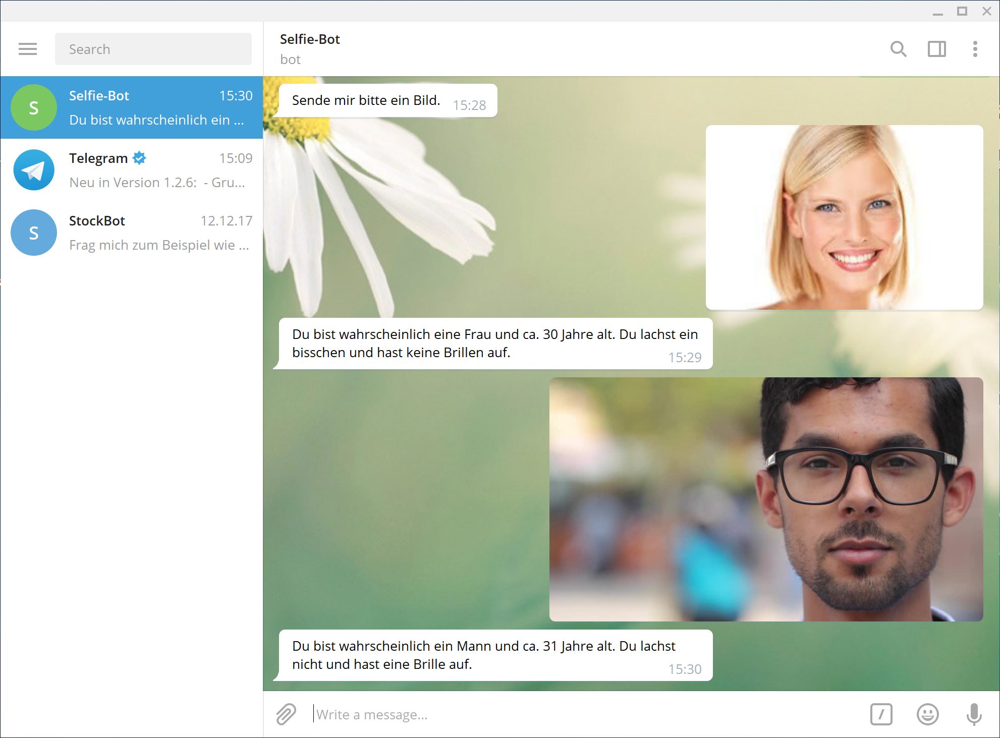
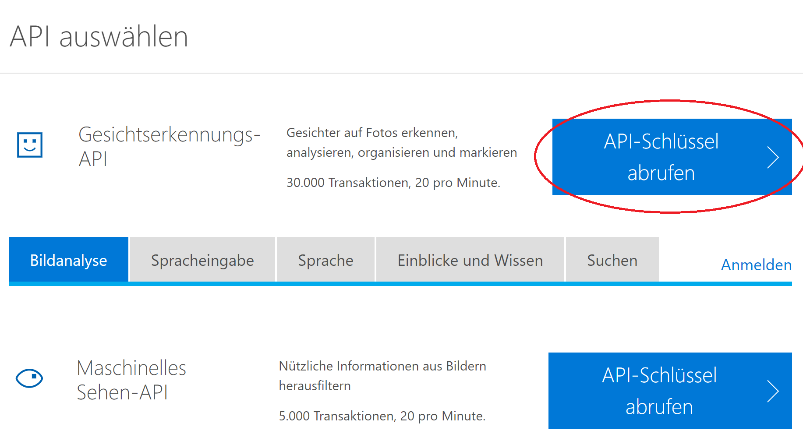
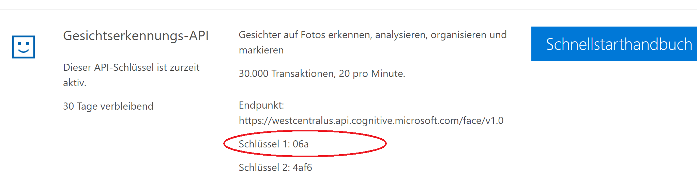
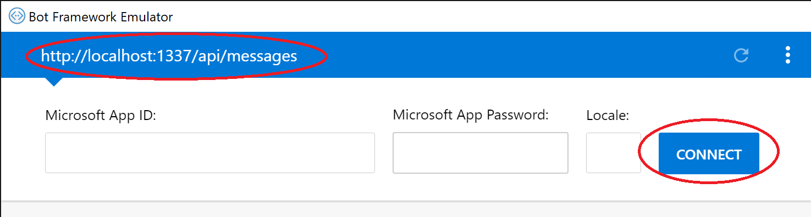

# Selfie-Bot
Dieser Bot wurde mit [Microsoft Botbuilder SDK v4](https://github.com/Microsoft/botbuilder-js) in Node.js geschrieben. Er nimmt ein Bild/Selfie entgegen und ruft [Microsoft Cognitive Services (Face API)](https://azure.microsoft.com/de-de/services/cognitive-services/face/) auf um das Bild zu analysieren hinsichtlich Geschlecht, Alter, Lächeln und Brille.



## Los geht's!

Folgende Schritte sind notwendig um den Bot zu entwickeln:

### 1) Notwendige Installationen
Installiere die letzte Version von **Visual Studio Code** kostenlos von [hier](https://code.visualstudio.com/).

Lade außerdem den [Bot Emulator](https://github.com/Microsoft/BotFramework-Emulator/releases/) für dein System sowie <a href="https://nodejs.org/en/download/">Node.js</a> herunter.

### 2) Keys abrufen
Wir verwenden Microsoft Cognitive Services um das Bild zu analysieren und benötigen dafür einen API-Schlüssel. Dazu wechseln wir auf [diese Seite](https://azure.microsoft.com/de-de/try/cognitive-services/?api=face-api) und wählen _API-Schlüssel abrufen_ aus. Es ist eine Azure Account notwendig um einen "Face" recognition key beziehen zu können. Wenn du einen anlegst, stelle sicher, dass als _Location_ **West Central US** ausgwählt ist.



Ein Microsoft oder Facebook-Konto ist notwendig um den Schlüssel generieren zu können. Der Schlüssel ist danach als Zeichenkette abrufbar.



### 3) Projekt laden und starten
Lade dieses Projekt herunter, öffne eine Konsole/Terminal und wechsle dort in den [/src](src) Ordner in dem sich die _package.json_ Date befindet. Tippe

```
npm install
```

um die fehlenden Pakete zu installieren. Wenn du die Mitteilung bekommst, dass der Befehl "npm" nicht gefunden werden kann, überprüfe ob du Node.js installiert hast. 
Als nächstes öffne Visual Studio Code und wähle unter _Datei_ > _Öffne Ordner_ den gerade heruntergeladenen Ordner aus. Öffne in Visual Studio Code die Datei [selfiebot.ts](src/selfiebot.ts) aus und ersetze den Platzhaltertext für ```private cognitiveServicesKey``` mit dem Schlüssel aus Schritt 2.

```typescript
private cognitiveServicesKey = "<ADD FACY API KEY HERE>"
```

Starte den Bot, indem du in Visual Studio Code auf _F5_ klickst. In der Debug Console solltest du nun folgende Zeilen sehen:


### 4) Bot im Emulator testen
Starte Bot Framework Emulator, klicke auf _File_ > _Open Bot_ und wähle die Datei [botconnect.bot](src/botconnect.bot) aus, clicke dann auf "Connect"

Du solltest nun mit dem Bot kommunizieren können. Tippe eine Nachricht oder sende ein Selfie!


