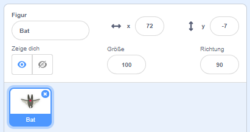
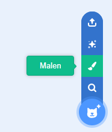
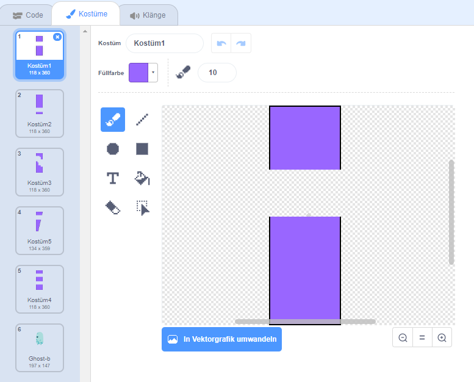
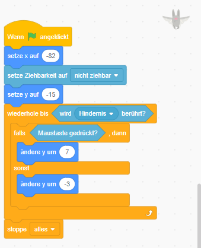
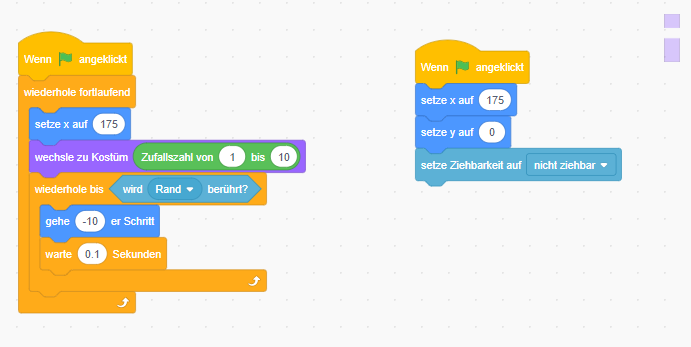

Fledermaus auf der Flucht
=========================

In diesem Spiel fliegst du als Fledermaus zwischen Hindernissen hindurch,
jedoch ohne diese zu berühren! Wie lange schaffst du es?

Schritt 1 – Erstelle die Figuren 
---------------------------------

Zuerst benötigen wir die Fledermaus und die Hindernisse, durch die die
Fledermaus hindurch fliegen soll.

Entferne die Katze mit einem klick auf X.

In der Figurenauswahl 
wähle die Fledermaus aus und ziehe diese in die
Arbeitsfläche. 

Verkleinere die Fledermaus-Figur in dem du die Zahl bei Größe verkleinerst.

 

und benenne die Figure um in „Fledermaus“.

Die Hindernisse müssen wir selbst zeichnen.

Klicke auf das “Malen” Symbol:

Zeichne ein Rechteck mit maximaler Höhe. Danach verwende den Radierer
um das Rechteck in zwei separate Rechtecke zu teilen. Somit haben wir
unser 1. Hindernis gezeichnet. Nun benenne diese um in "Hindernis".

Du kannst noch ein paar Hindernisse einfügen in dem du mit der rechten Maustaste auf Kostüm1 klickst und dann "Duplizieren" wählst. Ändere jedes Kostüm ein wenig ab, damit die Lücke nicht immer an der selben stelle ist. (Du kannst dir auch andere Hindernisse einfallen lassen, so wie zb. das Kostüm 6)

Platziere das Hindernis nun in die allgemeine Arbeitsfläche rechts neben der
Fledermaus.

Schritt 2 – Erstelle das Skript
-------------------------------

Da wir nun alles vorbereitet haben, können wir den Figuren nun Leben
einhauchen.

Sobald wir einen Linksklick machen, soll die Fledermaus zu fliegen
beginnen, ansonsten fällt die Fledermaus auf den Boden.

Wähle die Fledermaus aus und beginne mit dem Programmieren in dem du auf
“Code“ klickst. Schreibe deinen Code wie im folgenden Bild gezeigt:

Nun, klicke auf das Hindernis und schreibe folgenden Code:

Nun kannst du auf die grüne Flagge klicken und zu spielen beginnen, viel Spaß! :-)

Weitere Ideen:
--------------

Kannst du das Spiel noch weiter verbessern?

Versuche einen Zähler einzubauen, der mitzählt, wie oft du einem Hindernis überwunden hast.
Versuche neue Hindernisse zu finden.
Verändere die zahlen um die Fledermaus sinkt und steigt.
Kannst du die Fledermaus auch mit der Tastatur steuern?
