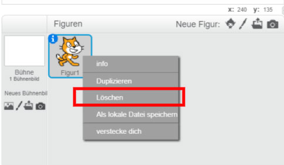
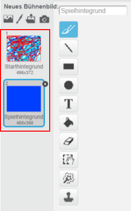
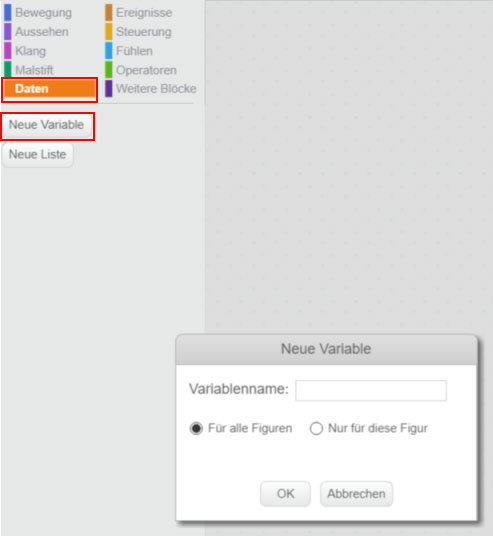
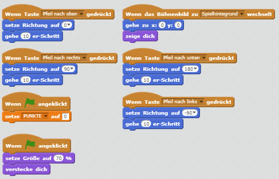
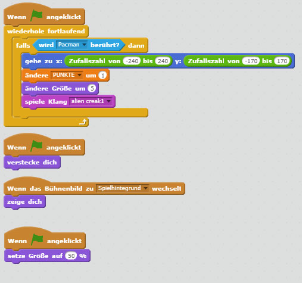
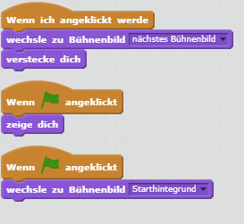

# Pac-Man Light (für Scratch 2.x)

In diesem Spiel sammelst du mit deinem Pac-Man sein Essen und bekommst dafür Punkte gutgeschrieben.

## Schritt 1 - Die Figuren

Als erstes müssen wir einmal die Katze entfernen. Dies machen wir mit einem Rechtsklick auf die Katze und drücken anschließend auf _Löschen_.



Danach können wir neue Figuren erstellen. Wir brauchen ingesamt drei Figuren: eine Figur für einen Pac-Man, zweite für das Essen und die dritte für einem Startknopf.


Du erstellst die Figuren in dem du in der Kategorie _Neue Figur_ auf den Pinsel klickst .


Alle drei Figuren musst du selber zeichnen.

## Schritt 2 - Die Hintergründe

Du musst dir einen neuen Hintergrund erstellen in dem du in Kategorie _Neue Bühnenbild_ auf das Pinsel klickst. Hier musst du hier zwei Kostüme erstellen. Den ersten nennst du ```Starthintergrund``` den zweiten ```Spielhintergrund```.




## Schritt 4 - Die Skripte

Damit das Spiel funktioniert müssen noch Skripte für alle Figuren eingefügt werden. Jede Figur hat seine eigenen Skript. Wenn man einen Skript bauen möchte kann man die Baussteine aus verschieden Kategorien verwenden. Ein Skript schreibt man in dem man auf die Figur klickt dann auf _Code_ und die Blöcke aus den einzelnen Kategorien verwendet.

Als erstes musst du eine Variable ```Punkte``` anlegen. Dies machst du indem du auf
_Daten_ klickst und anschließend auf _Neue Variable_ wählst.



Damit das Spiel funktioniert müssen noch Skripte für alle Figuren eingefügt werden. Jede Figur hat seine eigenen Skript. Wenn man einene Skript bauen möchte kann man die Baussteine aus verschieden Kategorien verwenden. Ein Skript schreibt man in dem man auf die Figur klickt und dann die Blöcke aus den einzelnen Kategorien verwendet.


Bei deinem _Pac-Man_ baust du dir folgendem Skript zusammen:



Bei der Figur _Essen_ diesen hier:



Bei deinem _Startknopf_ fügst du dieses Skript ein:



Toll gemacht!. Du kannst das Spiel jetzt starten in dem du auf die Flage klickst.


Zusatzaufgaben

* Versuche das Essen so zu programmieren das es nur eine Bestimmte Zeit auf einem Punkt bleibt und dann verschwindet und woanders wieder auftaucht.
* Versuche das Punktenstand so zu programmieren das wenn man gewisse Zeit nich was zu Essen kriegt, dass die Punkte substrahiert werden. Bei 0 hat men verloren, weil man verhungert hat.