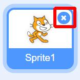
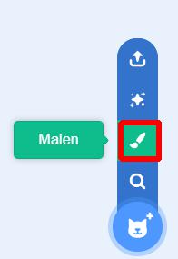
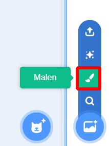
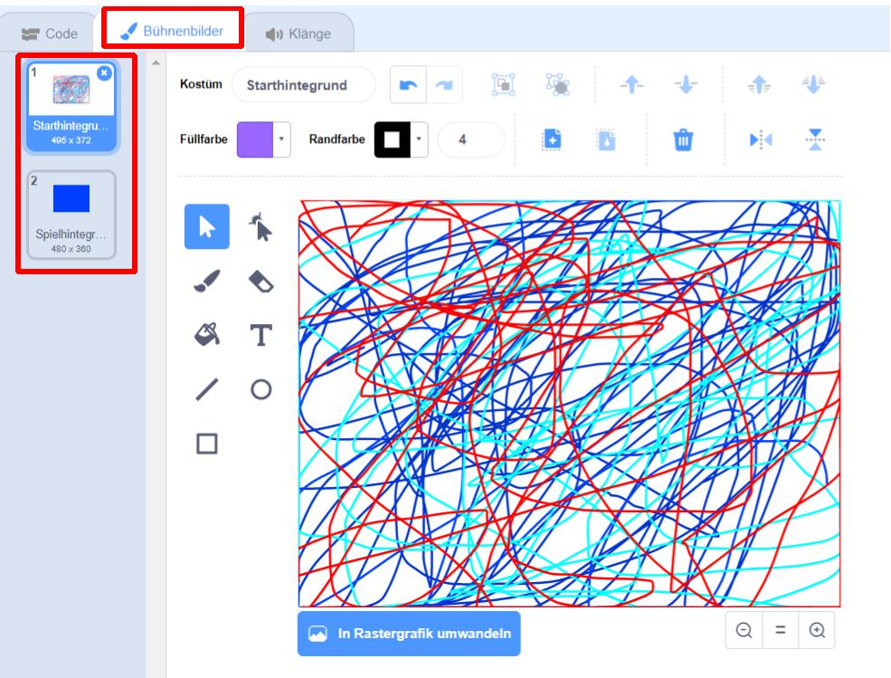
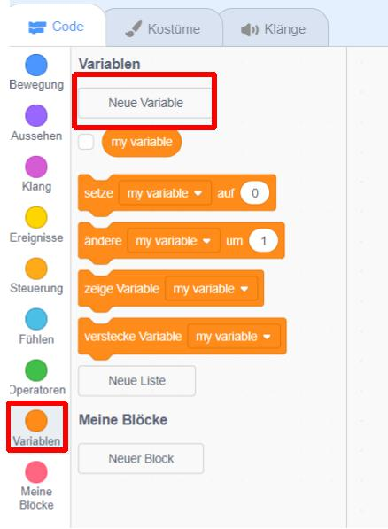
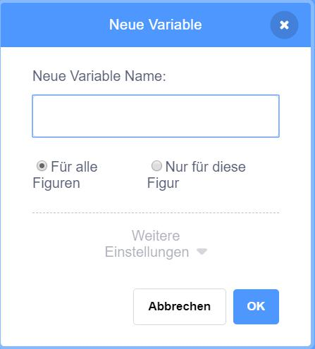
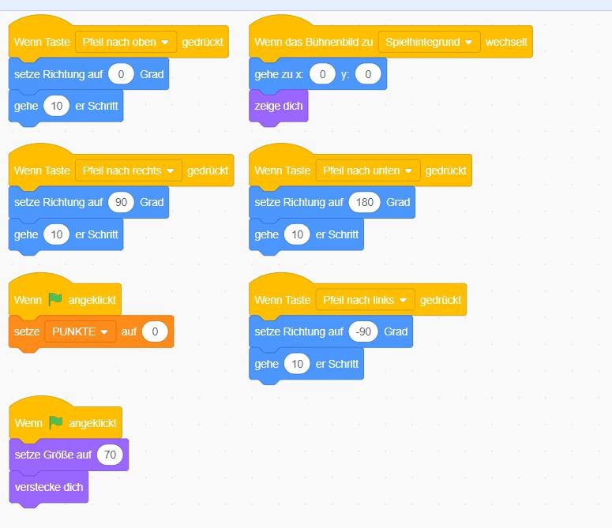
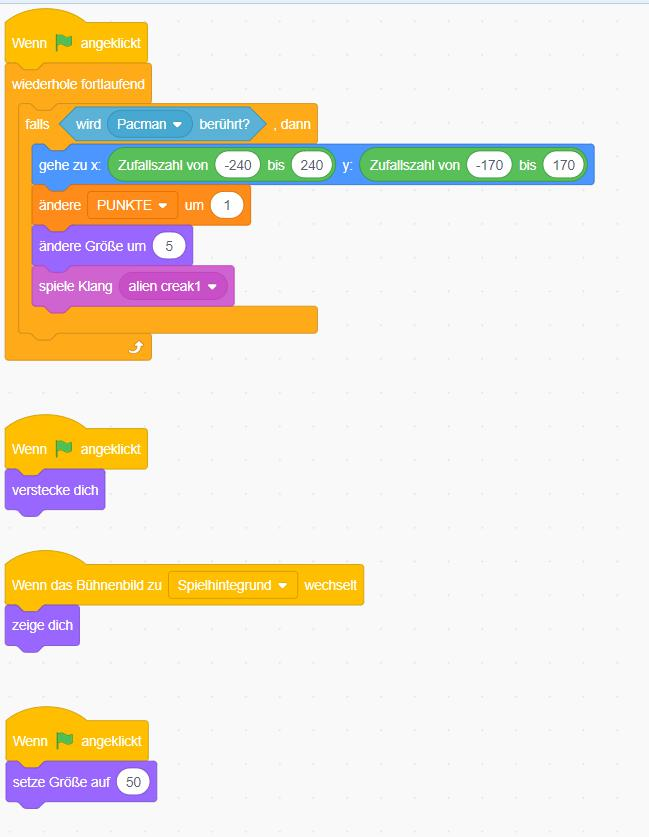
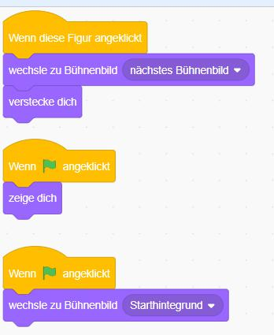

# Pac-Man Light (für Scratch 3.x)

In diesem Spiel sammelst du mit deinem Pac-Man sein Essen und bekommst dafür Punkte gutgeschrieben.

## Schritt 1 - Die Figuren

Als erstes müssen wir einmal die Katze entfernen. Dies machen wir mit einem Klick auf das _x_.



Danach können wir die neuen Figuren erstellen. Wir brauchen insgesamt drei Figuren: eine Figur für einen Pac-Man, eine für das Essen und noch eine für einen Startknopf.


Du erstellst die Figuren, indem du auf den Knopf _Figur wählen_ und auf den Pinsel klickst.



Alle drei Figuren musst du selbst zeichnen.

## Schritt 2 - Die Hintergründe

Du musst einen neuen Hintergrund erstellen, indem du auf den Knopf _Bühnenbild wählen_ drückst und danach auf den Pinsel klickst. Hier musst du zwei Kostüme erstellen. Das erste nennst du ```Starthintergrund``` das zweite ```Spielhintergrund```.




## Schritt 4 - Die Skripte

Damit das Spiel funktioniert, müssen noch Skripte für alle Figuren eingefügt werden. Jede Figur hat ihr eigenes Skript. Wenn man ein Skript bauen möchte, kann man Bausteine aus verschiedenen Kategorien verwenden. Ein Skript schreibt man, indem man auf die Figur klickt, dann auf _Code_ und die Blöcke aus den einzelnen Kategorien verwendet.

Als erstes musst du eine Variable ```Punkte``` anlegen. Dies machst du, indem du auf _Variablen_ klickst und anschließend _Neue Variable_ auswählst. Es ist egal in welcher Figur du die Variable anlegst, da diese für alle Figuren gültig ist.




Für deinen _Pac-Man_ baust du dir folgendes Skript zusammen:



Für die Figur _Essen_ dieses hier:



Bei deinem _Startknopf_ fügst du dieses Skript ein:



__Toll gemacht!__ Du kannst das Spiel jetzt starten, indem du auf die Flagge klickst.


Zusatzaufgaben

* Versuche das Essen so zu programmieren, dass es nur für eine bestimmte Zeit auf einem Punkt bleibt, dann verschwindet und woanders wieder auftaucht.
* Versuche den Punktenstand so zu programmieren, dass Punkte abgezogen werden, wenn man für eine gewisse Zeit kein Essen zu sich nimmt. Bei 0 Punkten hat man verloren, weil man verhungert ist.