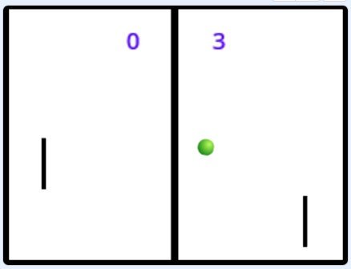

Pong
====

Das Spiel Pong ist schon ein richtiger Dinosaurier unter den Computerspielen. Es wurde bereits 1972 erstmals gespielt!

!(images/pong.jpg)

In diesem Spiel für zwei Personen geht es darum, einen Ball nicht passieren zu lassen, indem man ihn zum Gegner zurückspielt.
Lässt ein Spieler den Ball passieren, bekommt der andere Spieler einen Punkt. Gewonnen hat, wer zuerst 5 Punkte erreicht.
Gesteuert wird der Spieler auf der linken Seite mit den Tasten "w" und "s", der auf der rechten Seite mit Pfeil hinauf und hinunter.

Schritt 1 – Erstelle den Ball, den Rand und die Mittellinie 
-----------------------------------------------------------

Zuerst entferne die nicht benötigte Figur "Figur1" (Scratchy), indem Du auf das kleine Kreuz bei der Figur klickst.

!(/coderdojo-wien/exercises/tree/exercise/pong/scratch/Pong/images/figur1_entfernen.jpg)

Jetzt kannst Du einen Ball als Figur hinzufügen. 

!(/coderdojo-wien/exercises/tree/exercise/pong/scratch/Pong/images/ball_anlegen.jpg)

Für den Spielfeldrand benötigen wir vier Figuren, die aus je einem Rechteck besteht. Diese vier Figuren ordnet man so an, dass
sich daraus ein Rand am Spielfeld ergibt.

TIPP: Gib den vier Randstücken verständliche Namen (z.B. "oberer Rand", "unterer Rand", "rechter Rand", "linker Rand") - das 
erleichtert Dir später das Erstellen des Codes.

Eine weitere Figur wird für die Mittellinie benötigt.

!(/coderdojo-wien/exercises/tree/exercise/pong/scratch/Pong/images/rahmen_anlegen.jpg)

Schritt 2 – Erstellen der beiden Spieler 
---------------------------------------

Für jeden der beiden Spieler benötigen wir eine Figur, die aus einem Rechteck besteht. 

TIPP: Figuren kann man vervielfachen, indem man mit der rechten Maustaste draufklickt und dann "Duplizieren" auswählt.

!(/coderdojo-wien/exercises/tree/exercise/pong/scratch/Pong/images/spieler_anlegen.jpg)

Schritt 3 – Erstelle der Spielstandanzeige 
------------------------------------------

Zum Anzeigen des Spielstands benutzen wir zwei Figuren, die je sechs Kostüme besitzen. Das erste Kostüm stellt die Ziffer 0 dar, 
das zweite Kostüm die 1, das dritte Kostüm die 2 usw.

Ändere die Namen der Kostüme auf "0" für das erste Kostüm, "1" für das zweite Kostüm usw.

!(/coderdojo-wien/exercises/tree/exercise/pong/scratch/Pong/images/punkte_anlegen.jpg)

Schritt 4 – Die beiden Spielfiguren steuerbar machen
----------------------------------------------------

Damit sich die linke Spielfigur mit den Tasten "w" und "s" bewegen lässt, klick die linke Spielfigur an und füge im Reiter/Tab "Code" 
folgendes Programm ein.

!(/coderdojo-wien/exercises/tree/exercise/pong/scratch/Pong/images/code_linker_spieler.jpg)

Für die rechte Spielfigur füge folgendes Programm ein.

!(/coderdojo-wien/exercises/tree/exercise/pong/scratch/Pong/images/code_rechter_spieler.jpg)

Wenn du jetzt auf die grüne Flagge klickst, kannst du die Steuerung deiner Spielfiguren ausprobieren.

Schritt 5 – Dem Ball sein Verhalten beibringen
----------------------------------------------

Unser Spielball benötigt zwei Variablen ("Richtung" und "neue Richtung"), die du anlegst, indem du in der Kategorie "Variablen" auf den Knopf 
"Neue Variable" klickst. In dem Dialogfenster gibts du den Namen der Variable ein und wählst "Nur für diese Figur aus".

Nimm das Häckchen vor der Variable weg, wenn Du nicht möchtest, dass die Variable im Spielfeld angezeigt wird.

!(/coderdojo-wien/exercises/tree/exercise/pong/scratch/Pong/images/variablen_vom_ball.jpg)

INFO: Eine Variable ist ein Ort, an dem sich Dein Programm einen Wert (z.B. eine Zahl) merken kann. Auf den Wert, der sich gerade in einer 
Variable befindet, kannst du zu einem späteren Zeitpunkt zugreifen.

Damit der Ball sich wie gewünscht verhält, erstelle das folgendes Programm für ihn.

!(/coderdojo-wien/exercises/tree/exercise/pong/scratch/Pong/images/code_ball.jpg)

Wenn du jetzt auf die grüne Flagge klickst, kannst du ausprobieren, wie sich der Ball bewegt.

Schritt 6 – Die gewonnenen Punkte zählen und das Spiel beenden
--------------------------------------------------------------

Unser Spiel kann jetzt schon recht viel, aber die Spielstandanzeige funktioniert noch nicht. Um das zu ändern, klicke auf die Figur für 
die Punkte des linken Spielers und erstelle folgendes Programm.

!(/coderdojo-wien/exercises/tree/exercise/pong/scratch/Pong/images/code_punkte_links.jpg)

Für die Punkte des rechten Spielers wird folgendes Programm benötigt.

!(/coderdojo-wien/exercises/tree/exercise/pong/scratch/Pong/images/code_punkte_rechts.jpg)

Jetzt ist unsere Spiel bereit gespielt zu werden - viel Spaß!

Weitere Ideen:
--------------

* Bei Spielende könnte man den Gewinner verkünden oder ein "Game over" anzeigen.
* Damit es etwas schwieriger für die Spieler wird, könntest Du den Ball immer schneller werden oder die Spielfiguren immer kleiner werden lassen.
* Du könntest in das Spielfeld weitere Gegenstände stellen, an denen der Ball abprallt.

Verwendete Scratch-Version: 3.0 beta
Das Spiel zum Herunterladen gibt's [hier](pong.sb3)