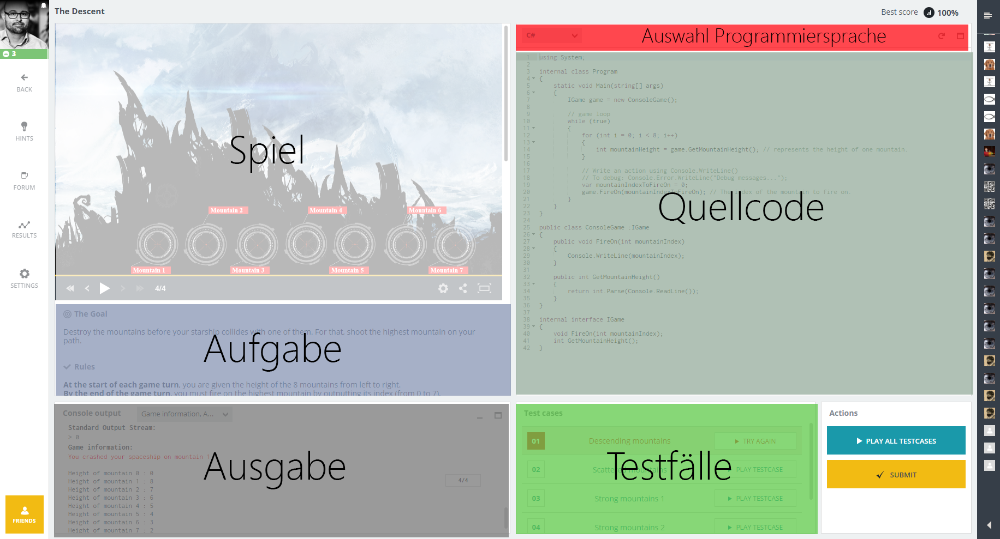
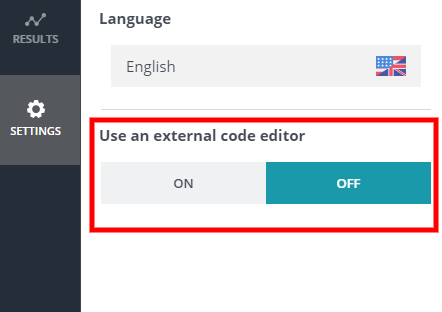
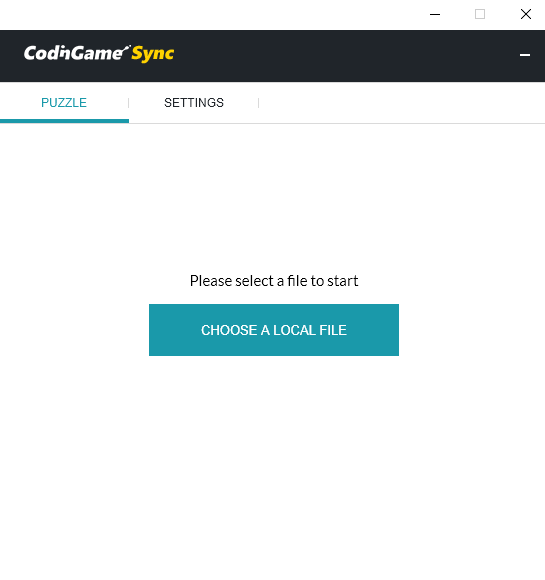
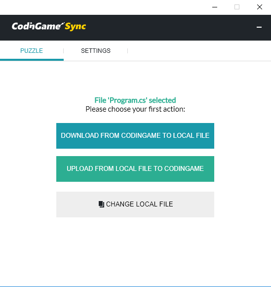
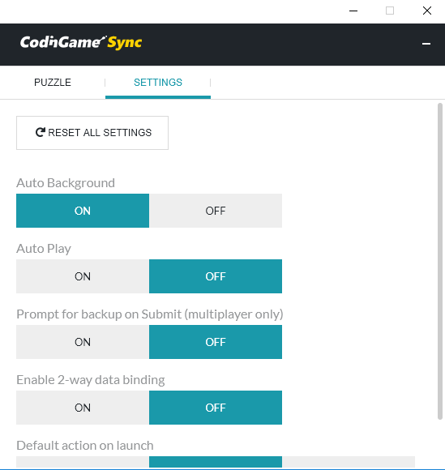

# Was ist CodinGame?
[CodinGame][1] ist eine Platform wo man programmieren lernen kann. Es gibt Aufgaben in verschieden Schwierigkeitsgraden die man mittels mehrere Programmiersprache lösen kann. Man kann entweder online programmieren oder, was noch besser ist, mittels eigenen Editor.

# Online Entwicklungsumgebung

Das online Entwicklungsumgebung besteht aus mehrere Bereichen:

* Aufgabe
	
	Hier gibt es beschrieben das Ziel und die Regeln

* Auswahl Programmiersprache

	Da wähl du die Programmiersprache in den die du Aufgabe lösen möchtest

* Quellcode

	Im Quellcodebereich schreibst du den Quellcode der die Aufgabe lösen soll

* Testfälle
	
	Durch die Testfälle kannst du überprüfen ob du die Aufgabe gelöst hast

* Ausgabe

	In Ausgabe siehst du Mitteilungen die durch das Program ausgegeben werden

* Spiel

	In diesen Bereich siehst du das Ablauf eines Spiels

## Entwicklen in eigenen Entwicklungsumgebung

### Einen neuen Projekt anlegen
Lege ein Projekt in deinem Entwicklungsumgebung. Wie du einen neuen Projekt in Visual Studio oder Visual Studio Code anlegen kannst du [hier](../Hello_World/Readme.md) nachlesen.

### Code synchronization
Wir zeigen dir wie du ein Code von [CodinGame][1] auf deinem Computer synchronizieren kann. Als erstes brauchst du dazu ein [Chrome Browser](https://www.google.com/chrome/). Dann must du dir folgende zwei erweiteung installieren:

* [CodinGame Sync App](https://chrome.google.com/webstore/detail/codingame-sync-app/nmdombhgnofjnnaenegcdehnbkajfgbh)
* [CodinGame Sync Ext](https://chrome.google.com/webstore/detail/codingame-sync-ext/ldjnbdgcceengbjkalemckffhaajkehd)

Wenn die Installation erfolgreich war, gehe auf das Puzzle (z.B. [The Descent](https://www.codingame.com/ide/puzzle/the-descent)). Auf die linke Seite ist ein _Settings_ Button. Wenn alles richtig funktioniert hat dann soll du auf die linke Seite _"Use external editor"_.

Schalte auf _ON_ damit erscheint ein neues Fenster. In _"Choose a local file"_ wähle eine Quelldatei aus.

Dann wähle _"Download from CodinGame to local file"_ aus.

Um nicht bei jeder Veränderung das Datei manuell hochladen zu mussen ist da eine hilfreiche Funktion. Schaltung auf _"Settings"_ um und schalte _"Auto background"_ auf _"ON"_.

[1]: https://www.codingame.com/